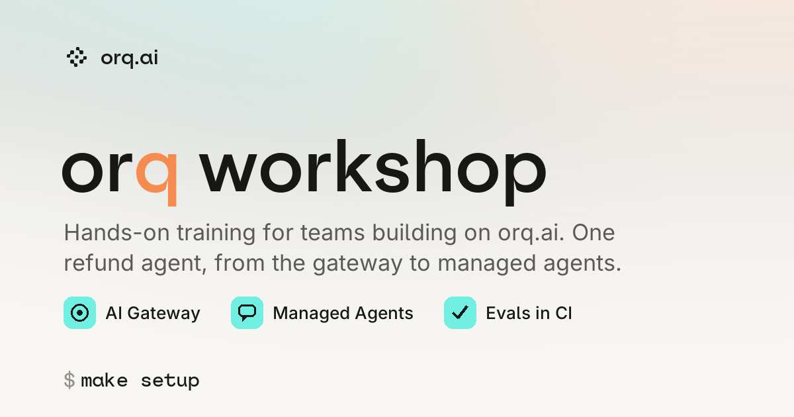
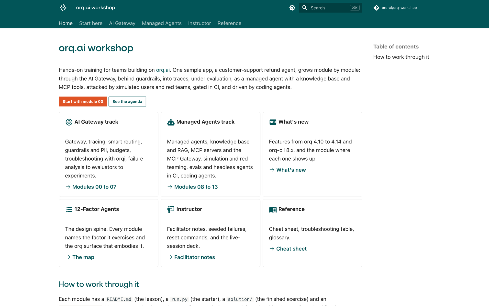

<p align="center">
  
</p>

# orq.ai workshop

Hands-on training for teams building on [orq.ai](https://orq.ai). One sample app, a customer-support refund agent, grows module by module: through the AI Gateway, behind guardrails, into traces, under evaluation, as a managed agent with a knowledge base and MCP tools, attacked by simulated users and red teams, gated in CI, and driven by coding agents.

Docs site: **https://orq-ai.github.io/orq-workshop** · Slides for a live session: `slides/`

<a href="https://orq-ai.github.io/orq-workshop">
  
</a>

## Quickstart

```bash
curl -fsSL https://cli.orq.ai/install.sh | sh     # orq CLI
orq auth login
git clone https://github.com/orq-ai/orq-workshop && cd orq-workshop
orq setup --local --capability gateway            # mints ORQ_API_KEY into ./.env
make setup                                        # uv sync, .env from the example
make doctor && make smoke                         # green checks + your first trace
```

Then open `modules/00-setup/README.md` or the docs site and go module by module. `make seed` creates every entity a module expects, so you can start anywhere. `make reset` deletes them all.

## The sections

Setup first, then the same three sections as docs.orq.ai. Module numbers are the build order (`make m01` … `make m17`); sections are the topic.

| Setup | AI Gateway | AI Observability | Managed Agents |
|---|---|---|---|
| 00 Setup: the orq CLI | 01 Gateway: fallbacks, retry, cache, load balancing | 02 Tracing: identity, thread, spans, annotations | 08 Managed agents |
| 13 Coding agents and wrap-up | 03 Smart routing and routing rules | 07 Failure analysis to evaluators to experiments | 09 Knowledge base and RAG |
| orqi harness | 04 Guardrails and PII | 14 Alerts and webhooks | 10 MCP servers and the MCP Gateway |
| 06 Troubleshooting with orqi | 05 Budgets, keys, identities, Terraform | 17 Annotation queues and automations | 11 Agent simulation |
| | | | 12 Evals and headless agents in CI |
| | | | 15 Advisor and sidekick |
| | | | 16 Red teaming |

Every module has a `README.md` (the lesson, with real expected output), a `run.py` (starter with TODOs), a `solution/` and an `agent_prompt.md` for the coding-agent path. Each ends with a **Done when** checklist.

**Prefer a notebook?** `make lab` opens JupyterLab with one notebook per module (01, 02, 03, 04, 08, 09, 14, 15, 17). Each is the solution split into steps: a cell of explanation, a cell that does one thing, the output underneath. The notebooks are generated from `solution/run.py` (Jupytext percent format), so they never drift from the script `make mNN` runs.

## Two ways to work

**By hand:** the Python SDK, the OpenAI-compatible gateway, the `orq` CLI, the Studio.

**With your coding agent:** `orq launch claude` (or `opencode`, `pi`, `codex`) routes the agent through the gateway and wires the orq MCP server and the orq skills. Paste the module's `agent_prompt.md`. Both leave the same traces.

## Layout

```text
app/refund_agent/   the sample app (never changes across modules)
app/data/           orders, policy docs, dataset, agent instructions
modules/NN-name/    README.md · run.py · solution/ · agent_prompt.md · assets/ (diagrams) · notebook.ipynb (generated, make notebooks)
evals/              CI regression gate (evaluatorq) and red-team gate
.github/workflows/  evals.yml · nightly-triage.yml · pr-failure-analysis.yml · docs.yml
docs/               MkDocs site (module pages include the module READMEs)
slides/             Marp deck and facilitator guide for a live session
```

## Requirements

Python 3.11 to 3.13, [uv](https://docs.astral.sh/uv/), the orq CLI 8.x, an orq.ai workspace with at least one chat model, one embedding model and one rerank model enabled. Node is only needed for `make slides` if `marp` is not installed.

## License

MIT
