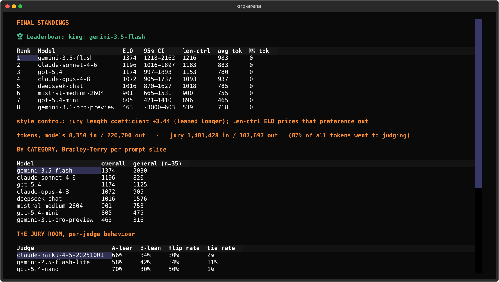
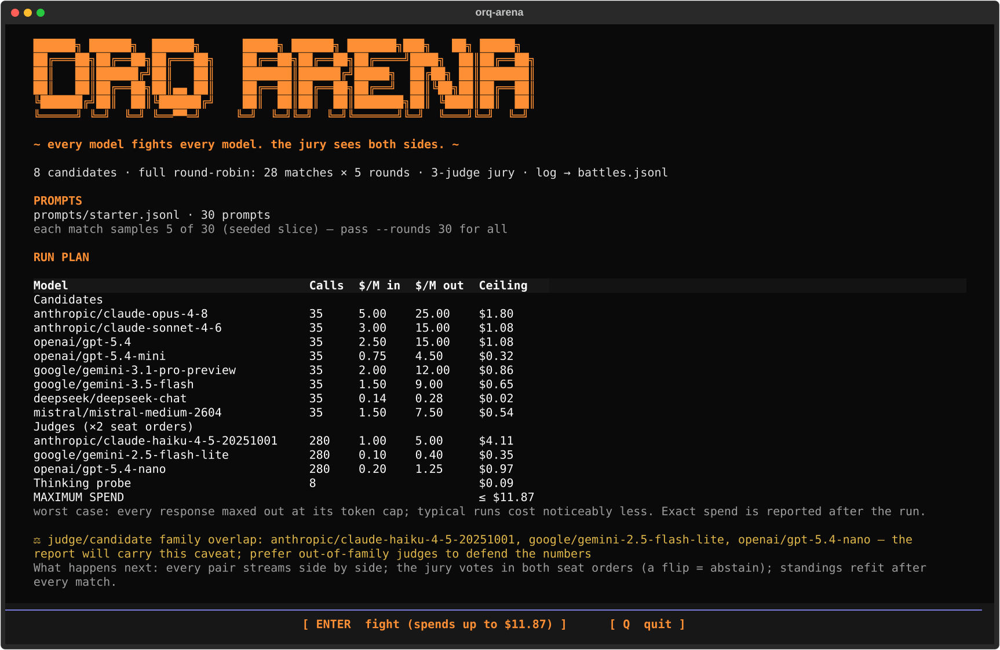

# orq-arena

[orq-arena](https://github.com/orq-ai/orq-arena) answers a different question from the rest of this section: not *is my agent good enough?* but **which model should I be using?**, decided on your own prompts instead of a public leaderboard.

It runs a round-robin tournament. Every model answers the same prompts, LLM judges compare the answers two at a time, and the wins become a chess-style **ELO leaderboard with confidence intervals**.

[:octicons-mark-github-16: orq-ai/orq-arena](https://github.com/orq-ai/orq-arena){ .md-button .md-button--primary }
[:octicons-book-16: Documentation](https://orq-ai.github.io/orq-arena/){ .md-button }


The banner is the tool doing its job: the top two models are **inside each other's error bars**, so the honest answer is not "opus wins" but "these two are tied, pick on cost". A single score would have reported a winner that the data does not support.

## Why a tournament and not a score

A scorer asks "did this answer pass?" Once every candidate model passes, the scores bunch up at the top and stop telling you anything. A **pairwise** comparison keeps discriminating: even when both answers are acceptable, a judge can still say which one is better.

The bias controls are the part worth knowing about, because they are what separate this from asking a model "which is better?" once:

- **Every pair is judged twice, with the answers swapped.** LLM judges have a position bias; swapping and re-judging cancels it.
- **Unreliable judges are flagged**, so a panel that contradicts itself does not quietly set your ranking.
- **Jury swaps** let you re-judge saved battles with a different panel, paying only for judge tokens rather than re-running every model.

## What you get

| Output | What it is for |
|---|---|
| **ELO leaderboard** | the ranking, with 95% confidence intervals (overlapping intervals mean *you do not have a winner yet*) |
| **HTML report** | verdict, leaderboard, quality-vs-cost charts, win grids |
| **`battles.jsonl`** | the raw pairwise preference data, reusable as a dataset |
| **Live TUI** | watch the tournament as it runs |
| **Human spot-check** | annotate a sample yourself to confirm the judges agree with you |



The quality-vs-cost chart is usually the one that changes a decision: the top model and the model you can afford are rarely the same, and the gap is often smaller than expected.

## Run it

```bash
$ git clone https://github.com/orq-ai/orq-arena.git && cd orq-arena
$ uv tool install .
$ orq-arena run --config orq_arena.yaml --prompts your_prompts.jsonl
$ orq-arena run --config orq_arena.yaml --prompts your_prompts.jsonl --tui   # live view
```

Before it spends anything it prints a **run plan**: the prompt file, the model pool, the per-model call count, the input and output price per million tokens, and a worst-case cost ceiling:



Needs Python 3.10+ and an orq.ai API key. Every model and judge call goes through the orq AI Router, so the whole tournament is traced, costed and budgeted like any other workload in this workshop, which is also how the cost axis of the report gets its numbers.

## orq-arena or evaluatorq?

They sit either side of one decision and answer different questions:

| | [evaluatorq](evaluatorq.md) | orq-arena |
|---|---|---|
| **Question** | does *my agent* meet *my* bar? | which *model* wins on *my* prompts? |
| **Compares against** | criteria you wrote (pass or fail) | the other models in the field |
| **Unit of work** | a job over a dataset, a simulated conversation, an attack | a prompt answered by every contender |
| **Output** | scorer means, verdicts, an exit code | an ELO ranking with confidence intervals |
| **Use it to** | gate a PR, catch a regression, find a vulnerability | choose the model, or justify switching |
| **Cadence** | every change, in CI | when the field moves, or before you commit to a model |

The usual order is arena first, evaluatorq forever after: pick the model with a tournament, then keep it honest with a regression gate. The pairwise data also feeds model selection for [smart routing](../modules/03.md): a strong model and an economical one, chosen with evidence rather than vibes.

## Where to go next

- The repo: [orq-ai/orq-arena](https://github.com/orq-ai/orq-arena)
- The docs: [orq-ai.github.io/orq-arena](https://orq-ai.github.io/orq-arena/)
- In this workshop: [module 03](../modules/03.md) routes between models once you have picked them, and [module 07](../modules/07.md) turns a chosen model's failures into evaluators.
