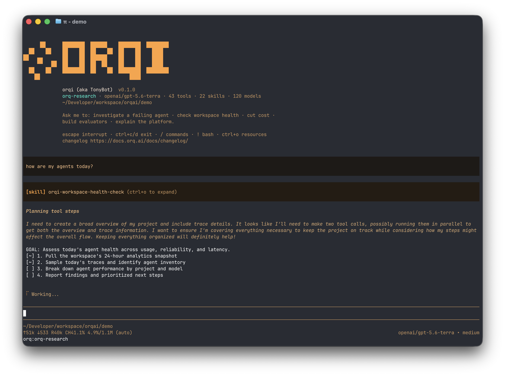

# orqi harness

**[orqi](https://github.com/orq-ai/orqi)** (aka TonyBot) is the orq.ai helper agent in your terminal. Ask it to investigate a failing agent, check workspace health, cut cost, build evaluators, or explain the platform, and it answers with your workspace's own tools, models and skills already wired in. No setup, no glue code.

It embeds the [pi coding agent](https://github.com/earendil-works/pi) in-process and boots with the orq MCP tools, the orq skills and the orqi system prompt already wired in. It operates the platform; it does not build your app. For that, module 13 wires your own coding agent through `orq launch`.

It is open source and developed in the open: the binary you install below is built from it, and issues and releases live there:

[:octicons-mark-github-16: orq-ai/orqi](https://github.com/orq-ai/orqi){ .md-button .md-button--primary }



```bash
orqi                                   # interactive TUI
orqi "why did my agent fail today?"    # one-shot, prints and exits
```

!!! warning "Alpha"
    Under active development. Expect rough edges and breaking changes. Pin the release with `ORQI_VERSION=<tag>` when a workshop needs reproducible output.

## Install

<!-- termynal -->

```console
$ curl -fsSL https://raw.githubusercontent.com/orq-ai/orqi/main/install.sh | sh
---> 100%
$ orqi --version
```

Pulls the latest release binary into `~/.local/bin`, no clone, no Bun. Two other doors:

```bash
$ orq orqi                # the orq CLI (8.x) installs orqi on first use and hands it your login
$ orqi update             # replace the binary with the latest release
```

orqi checks once a day and prints a header note when a newer release exists; `orqi update` itself never runs automatically. Keep the orq CLI on `PATH` either way: `/whoami`, `/workspace` and `/doctor` shell out to it.

## Sign in

Three candidates, best first: a pinned profile's key, then `ORQ_API_KEY`, then the `orq auth login` session. Each is tried on the real connection, so a rejected one falls through to the next.

```bash
# 1. Nothing set: the login session from module 00.
$ orq auth login
$ orqi

# 2. A key on its own. No CLI login needed.
$ export ORQ_API_KEY=sk-orq-EXAMPLEKEY000000000000000
$ orqi

# 3. A profile, pinned for one command. Its own server comes with it.
$ orq auth profile add acme-staging sk-orq-EXAMPLEKEY111111111111111   # once
$ ORQ_PROFILE=acme-staging orqi "which agents are failing?"
```

For this workshop use the repo key, so orqi looks at the same project your app writes to, and never echo it:

```bash
$ set -a; source .env; set +a; orqi
```

Every run starts with a header that tells you what was loaded:

```text
orqi (aka TonyBot) · 624ccbbd · openai/gpt-5.6-terra · 43 tools · 22 skills · 133 models · skills 9634e1d9 · ORQ_API_KEY
```

The last field is the credential that won. `ORQ_API_KEY` means it used the key you exported; `orq login session` means it read the session from `orq auth login`. The full resolution order, host precedence and every failure message are in [docs/credentials.md](https://github.com/orq-ai/orqi/blob/main/docs/credentials.md).

## What it ships with

| | |
|---|---|
| **orq AI Router** | The only model provider, so `/model` offers exactly the models the workspace has enabled. One credential covers the LLM and the tools |
| **6 workspace commands** | `/tools`, `/whoami`, `/workspace [key]`, `/doctor`, `/whatsnew` (the orq.ai changelog), `/update` |
| **43 orq MCP tools** | Every tool the workspace's MCP server exposes, wrapped as native tools with an `orq_` prefix. Results render as a one-line summary (`23 items · 6.0 KB`); `ctrl+o` expands to pretty-printed JSON. The model always receives the full payload |
| **22 skills** | 15 from [orq-ai/assistant-plugins](https://github.com/orq-ai/assistant-plugins) plus 7 of its own: `workspace-health-check`, `investigate-root-cause`, `debug-conversation`, `optimize-cost`, `setup-guardrails`, `manage-knowledge-base`, `platform-guide`. The upstream 15 refresh themselves once a day |
| **3 subagents** | `investigator`, `analyst`, `docs`, in-process, each with its own context window and a narrow orq tool subset |

The main agent delegates a self-contained task to a subagent when a question fits one pillar; the subagent sees nothing but that task:

| Subagent | Job |
|---|---|
| `investigator` | walks a failing trace's span tree to the first upstream failure, classifies it (specification / generalization / tool-retrieval / data-eval) and reports the root cause with trace ids, span names and failing arguments |
| `analyst` | reads workspace analytics (cost, latency, error rate, model mix), shows the numbers behind every claim and quantifies any recommendation |
| `docs` | answers platform questions strictly from the orq documentation, grounds each claim in a search hit, says so when the docs are silent |

## First session

Start it with the repo key exported and try the commands before the prompts:

| Command | What it does |
|---|---|
| `/doctor` | runs `orq doctor`, the same 16 checks as module 00 |
| `/whoami`, `/workspace` | which workspace and project the tools point at |
| `/tools` | the 43 `orq_` tools by name |
| `/model` | the workspace's enabled models, nothing else |
| `/whatsnew` | the orq changelog, so "is this in 4.14?" has an answer |
| `ctrl+o` | expand the last tool result or skill |
| `escape` | interrupt the turn |

One-shot answers take 15 s to 2 min. The `GOAL:` and `[x]` lines are progress; the answer is what follows.

## Environment

The five variables that matter in this workshop. The [README](https://github.com/orq-ai/orqi#environment) lists the rest (on-prem endpoints, cache refresh, theme).

| Variable | Purpose |
|---|---|
| `ORQ_API_KEY` | Credential; falls back to the `orq auth login` session when unset or rejected. A pinned profile outranks it |
| `ORQ_SERVER` | API base URL (default `https://api.orq.ai`), and so which login session the CLI resolves |
| `ORQ_PROFILE` | Which API-key profile the orq CLI authenticates with; orqi follows it |
| `ORQI_MODEL` | Router model (default `openai/gpt-5.6-terra`) |
| `CI` | Any value suppresses the daily update check; use it in scripts and in `make m06` |

orqi keeps its own agent dir (`~/.orqi/agent`) and never touches `~/.pi`.

## Next

[Module 06](../modules/06.md) puts orqi to work on the failures modules 01 to 04 left in your workspace: a health check, a root-cause report for a real trace, a client-side 404 it cannot see in Traces, and a docs question.
