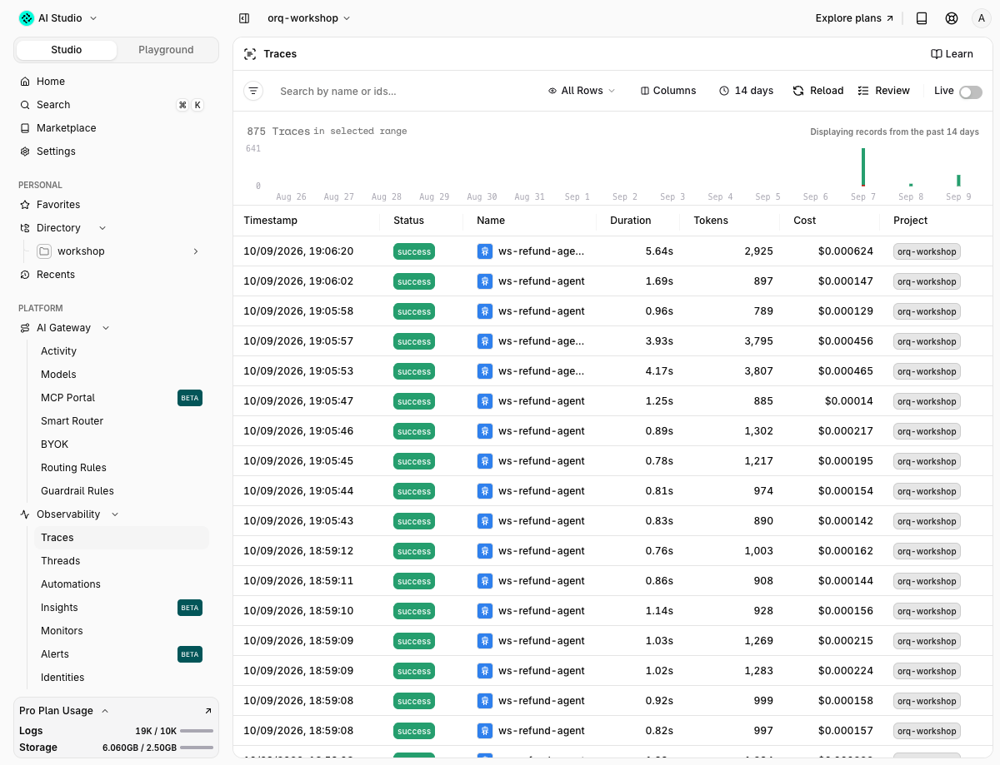

# 02 · Tracing

!!! abstract "Factor 3: Own your context window, and Factor 5: Unify execution and business state"
    The trace is the context window you can read after the fact: every model call, every tool result, in order. Identity, thread and metadata ride on the same request, so who asked, in which conversation, on which plan, is on the trace and not in a side table.

| | |
|---|---|
| **Time** | 30 min |
| **Prerequisites** | module 01 |
| **You will have** | traces you can search by thread and customer, one trace that reads `refund_turn -> tool -> llm`, one human annotation on it. |

## Why

Module 01 left traces behind without a line of code. This module makes them yours: name them, group them per conversation, attach the customer, then add your own spans so the agent loop is one trace instead of one trace per model call. Every later module (failure analysis, evals, red teaming) starts from these traces.

## The one concept to understand first

Three things decide what a trace looks like, and all three are in your hands:

1. **Request fields.** On `/v3/router/responses` (and on `/chat/completions`), `name`, `identity`, `thread` and `metadata` are top-level fields of the request body. The OpenAI SDK forwards them through `extra_body`. They become filters in the Studio and in `orq.traces.search` ([request metadata](https://docs.orq.ai/docs/ai-gateway/request-metadata), [thread management](https://docs.orq.ai/docs/ai-gateway/thread-management)).
2. **The W3C `traceparent` header.** When a gateway call carries it, the gateway continues your trace instead of starting its own. `run_turn` adds it from the active `@traced` span (via `orq_ai_sdk.traced.propagation_headers()`).
3. **`@traced` spans.** `@traced(type="agent")` and `@traced(type="tool")` from `orq_ai_sdk.traced` add the spans the gateway cannot see. With `TRACING=otel` the app's `setup_otel()` exports them over OTLP to `https://my.orq.ai/v2/otel`.

```python
body = {"name": "refund-turn", "identity": {"id": "customer-user_001"}, "thread": {"id": thread_id}, "metadata": {"tier": "free"}}
chat("Refund ord_a2 please", extra_body=body)

@traced(type="agent", name="refund_turn")
def refund_turn(text):
    return chat(text)   # run_turn sends traceparent, the gateway nests under this span
```


## Steps

Open `modules/02-tracing/run.py`. Each step is a function with a `TODO`. The solution is in `solution/run.py`.

### Step 1 · The traces you already have

```bash
$ uv run python modules/02-tracing/run.py
```

Expected output (first block):

```text
[1] zero-code      trace=6d56828205da8bb37663f82490200e33 tools=['lookup_order', 'get_policy']
    470bbd53dd82b4c8cb5f632adb2a6d91  responses.openai ok      1623 ms  $0.000198
    e5b46f628ee1ad93a6d01c6c90e6130d  responses.orq-research@orq ok      1517 ms  $0.000179
    91f143a265851d2910348d3e1eeaed65  pii restore      unset       0 ms  $0.000000
    ecdc58efac65f587d7f5287f1965f0ba  pii redact       unset      54 ms  $0.000000
```

Every gateway call is a trace named after its endpoint, `responses.openai` here (`chat.openai` for chat completions, `responses.<workspace>@orq` for a smart router; the `pii *` rows are module 04's plugin from an earlier run). A turn with two tool calls is three traces. The same list from the CLI, and one trace rendered as a conversation:

```console
$ set -a; source .env; set +a          # the CLI otherwise searches the project of your `orq` session
$ orq traces search --from now-10m --to now --limit 3 -o json | jq -c '.data[] | {trace_id, name, status, cost: .cost.total}'
{"trace_id":"e4119747783704db32ff153043c1fa9a","name":"responses.openai","status":"ok","cost":0.0002204}
{"trace_id":"24db29ca280446773e74878862b7391d","name":"responses.openai","status":"ok","cost":0.0002044}
{"trace_id":"b56aa7c55447d568b8a099e81ad7b313","name":"responses.openai","status":"ok","cost":0.00025865}
$ orq traces thread 6d3815f83d19c502ea7bef614d67bc8a
```

```text
<thread trace="6d3815f83d19c502ea7bef614d67bc8a" span="14b9946e7718e1d7" format="responses" model="gpt-5.6-luna" duration_ms="1530" tokens="1485">

<message index="0" role="user">
It was damaged in transit. Please refund it.
</message>

<message index="1" role="assistant">
[content unavailable: 2 items]
</message>

</thread>
```

`[content unavailable: 2 items]` is the CLI, not the trace: orq-cli 8.6 renders chat-completions transcripts and shows Responses output items (a reasoning item plus the message) as unavailable, in every output format. The Studio's thread view renders them. Chat-completions traces render in full, as module 04's captures show.

### Step 2 · Name, identity, thread, metadata

Fill `step_2_thread`: put `name`, `identity`, `thread` and `metadata` in `extra_body`, call `chat()` twice with the same thread id and the first turn's `messages` as history, then search by `thread_id`.

```text
[2] thread         id=ws-thread-9a2d79c4
    turn 1 trace=14e3eaa42eaf74afb9501aa0817395b5 tools=['lookup_order', 'get_policy', 'get_policy']
    turn 2 trace=6d3815f83d19c502ea7bef614d67bc8a tools=[]
    search thread_id=ws-thread-9a2d79c4 -> 4 traces: ['6d3815f83d19c502ea7bef614d67bc8a', '14e3eaa42eaf74afb9501aa0817395b5', 'b86261f809268f38f2a40e49323e5b34', 'a6f1c0edd571fd176540dc91d7555225']
    turn 2: name=refund-turn identity_id=customer-user_001 thread_id=ws-thread-9a2d79c4
```

Four traces, one conversation: turn 1 made three model calls, turn 2 made one. In the Studio, open **Traces**, filter on Thread ID, and the four line up. The same filters work on `identity_id`, `metadata.tier` and `name`:

```console
$ orq traces search --from now-15m --to now --filters '[{"field":"thread_id","op":"eq","values":["ws-thread-9a2d79c4"]}]' -o json | jq -c '{rows: .meta.row_count, traces: [.data[].trace_id]}'
{"rows":4,"traces":["6d3815f83d19c502ea7bef614d67bc8a","14e3eaa42eaf74afb9501aa0817395b5","b86261f809268f38f2a40e49323e5b34","a6f1c0edd571fd176540dc91d7555225"]}
```

### Step 3 · One trace per turn with `@traced`

Set `TRACING=otel` in `.env`, or call `tracing.setup_otel(force=True)` as the solution does (a shell export loses to `.env`). Fill `step_3_otel`: decorate `refund_turn` with `@traced(type="agent", name="refund_turn")` and wrap each tool dispatch in `@traced(type="tool", name=name)`. `run_turn` already sends the `traceparent` of the active span. `app/` does not change: the solution replaces `agent.dispatch` at runtime.

```text
[3] otel + @traced trace=4f3e9ca40c2e175bdf1be2befd29f4be tools=['lookup_order', 'get_policy']
    root    trace                  refund_turn                  unset                        b60522d48d5e13d4
      child trace                  responses.openai             ok    gpt-5.6-luna           fc1c5efc49a7f578
      child span.responses         chat openai/gpt-5.6-luna     ok    gpt-5.6-luna           2ba6e64002d55cbd
      child span.agent_tool_execution lookup_order                 ok                           2f66d5d27db75cbf
      child trace                  responses.openai             ok    gpt-5.6-luna           022e8c794385197a
      child span.responses         chat openai/gpt-5.6-luna     ok    gpt-5.6-luna           4a0a9a9ff08b2f51
      child span.agent_tool_execution get_policy                   ok                           283e901bc5434e61
      child trace                  responses.openai             ok    gpt-5.6-luna           ff4603cb59c59ff6
      child span.responses         chat openai/gpt-5.6-luna     ok    gpt-5.6-luna           21458579ad8b5d0b
```

One root `refund_turn` span, four gateway calls nested under it, three tool spans between them in the order the model called them. `tracing.flush()` before exit matters: the batch exporter ships on a timer and a short script exits first.

### Step 4 · Annotate the answer

Fill `step_4_annotation` with `annotations=[{"key": "rating", "value": "good"}]` on the last `span.responses`.

```text
[4] annotation     rating=good on span 21458579ad8b5d0b of trace 4f3e9ca40c2e175bdf1be2befd29f4be
```

A key has to exist as an annotation definition first. This workspace has `rating`; any other key returns:

```text
Status 404. Body: {"code":"deployment_not_found","message":"The human review with key \"ws-does-not-exist\" for workspace 624ccbbd-... was not found.","category":"not_found",...}
```

If you get that for `rating`, create it in the Studio: **Optimization > Annotations > Create**, key `rating`, type categorical with values `good` and `bad`, then rerun. Annotations are queryable later (module 04 uses them as labels).

### Step 5 · Stretch: a framework does this for you

```bash
$ uv run python modules/02-tracing/solution/stretch_langgraph.py
```

```text
answer : I've processed your refund for order ord_a2, as the dock does not fit your laptop. You will see the amount of EUR 89.00
steps  : ['human', 'ai', 'tool', 'ai', 'tool', 'ai', 'tool', 'ai']
trace  : 01a082fcf4ca7cb1ba6b49f581e2d0b5  spans=31  {'trace': 1, 'span.agent': 7, 'span.chain': 16, 'span.chat_completion': 4, 'span.tool': 3}
```

One `setup()` from `orq_ai_sdk.langchain` before the graph is built, and every node, tool and model call is a span; the Studio draws the graph next to the trace. Strands agents get the same treatment through OpenTelemetry: [docs.orq.ai/docs/ai-studio/integrations/frameworks/aws-strands](https://docs.orq.ai/docs/ai-studio/integrations/frameworks/aws-strands).

## With your coding agent

```bash
$ orq launch claude
```

Paste `agent_prompt.md`:

> Use the `setup-observability` skill against this repository. Do not change anything: report what the skill would change, which integration mode it picks for this app, which spans it would add with `@traced` and with which types, and which of its recommendations the module already implements. Then use the orq MCP tools to fetch the spans of the most recent trace named `refund_turn` and tell me the order of tool spans and model calls inside it.

## Proof



## Done when

- [ ] `orq traces search` filtered on your thread id returns every model call of the conversation
- [ ] A trace with a root span named `refund_turn` and three `span.agent_tool_execution` children exists
- [ ] That trace carries a `rating` annotation (open it in the Studio, Annotations panel)
- [ ] `git status` shows changes under `modules/02-tracing/` and `.env` only

## Gotchas

- `.env` beats the shell: `TRACING=otel uv run ...` still reads `TRACING=gateway` from `.env`. Edit `.env` or do what the solution does.
- On both router endpoints, `identity`, `thread` and `metadata` worked as top-level body fields here. Nested under `orq` (the shape the request-metadata docs describe for this endpoint) they were silently ignored: `identity_id` and `thread_id` stayed empty.
- The SDK's automatic `traceparent` injection (a patch on `httpx.Client.send`) did not reach the OpenAI client (openai 3.9, httpx 0.28), so `run_turn` merges `propagation_headers()` into the request headers itself. If you call the gateway from your own code inside a `@traced` function, pass `extra_headers=propagation_headers()`.
- `orq traces search` needs `--from` and `--to`; relative values are `now-10m` and `now`. Without `ORQ_API_KEY` in the shell the CLI searches the project of your `orq` session, which is not necessarily this one.
- `orq.traces.get` and `get_span` return the metadata block empty in SDK 4.14.14. `orq request GET /v3/traces/<id> -o json | jq .body.trace.attributes.metadata` shows it.
- `list_spans` reports the `@traced` root as type `trace` and tools as `span.agent_tool_execution`; the Studio reads the `agent` / `tool` type from the span attributes. Gateway model spans are `span.responses` on the Responses endpoint and `span.chat_completion` on chat completions; filter on both.
- `orq traces thread` prints `[content unavailable: N items]` for a Responses-format assistant turn (orq-cli 8.6). Use the Studio thread view, or `orq traces get-span` on the span for the raw output.

## New in orq 4.14

Every trace span now shows guardrail and evaluator indicators, the Traces view has a time-range selector and search by id, and (since 4.11) Human Review is called Annotations with queues and the API used in step 4.

## Go further

Filter by `metadata.tier` in the Studio and save it as a view: that is the "free tier customers" slice module 05 puts a budget on. The `orq traces thread` command accepts `--slice -1` to print only the last message, which is what `orq traces insights` summarises across a time range.

Docs: [Traces](https://docs.orq.ai/docs/ai-studio/observability/traces), [Observability quickstart (OTLP)](https://docs.orq.ai/docs/ai-studio/observability/quickstart), [Span attributes](https://docs.orq.ai/docs/ai-studio/observability/span-attributes), [Request metadata](https://docs.orq.ai/docs/ai-gateway/request-metadata), [Thread management](https://docs.orq.ai/docs/ai-gateway/thread-management), [Identities](https://docs.orq.ai/docs/ai-studio/observability/identities), [Annotations](https://docs.orq.ai/docs/ai-studio/observability/annotations), [LangGraph integration](https://docs.orq.ai/docs/ai-studio/integrations/frameworks/langgraph).
