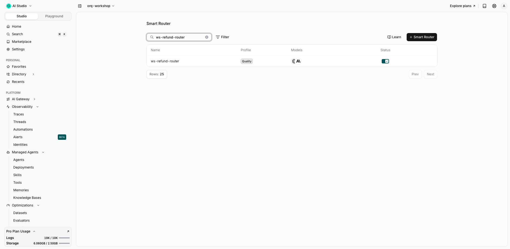
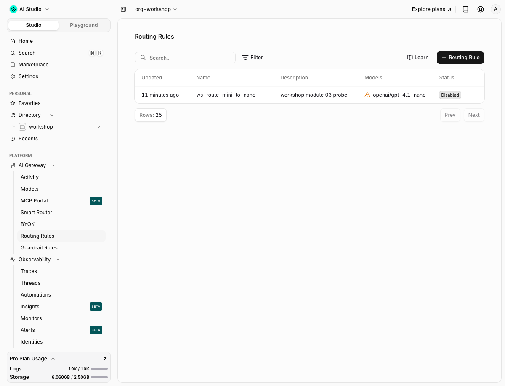

# 03 · Smart routing

!!! abstract "Which model answers is a decision"
    Which model answers is a decision. This module moves that decision out of the code and into two places you can read and change at runtime: a Smart Router that picks per request, and a routing rule that overrides it.

| | |
|---|---|
| **Time** | 20 min |
| **Prerequisites** | module 01 |
| **You will have** | a Smart Router `ws-refund-router` the refund agent calls by reference, traces that show which model it picked and why, and a routing rule that redirects cheap-tier traffic to `gpt-5.4-nano`. |

## Why

`MODEL=openai/gpt-5.6-luna` in `.env` is a guess frozen at deploy time. Easy questions overpay on a strong model, hard ones underdeliver on a cheap one. A Smart Router grades each request and picks from a pool; a routing rule pins traffic that matches a CEL expression to a target. Both leave a span in the trace, so the decision is auditable.

## The one concept to understand first

A [Smart Router](https://docs.orq.ai/docs/ai-gateway/smart-router) is a model id. `orq.smart_routers.create(key=..., models=[...], profile=...)` returns `model_ref` like `orq-research@orq/ws-refund-router`; you pass that where you passed `openai/gpt-5.6-luna`. The profile (`COST`, `BALANCED`, `QUALITY`) tunes how aggressively it prefers economical models over stronger ones. The trace gets a `span.auto_router` span and the `span.chat_completion` below it names the winner.

A routing rule sits in front of that: `expression.cel` decides if it applies, `models_config` says where the request goes instead. The CEL variables are `model`, `metadata["key"]`, `identity`, `headers["name"]` and `project`. When a rule matches it replaces the request's `model`, `load_balancer` and `fallbacks` entirely.

```python
router = orq.smart_routers.create(key="ws-refund-router", models=POOL, profile="SMART_ROUTER_PROFILE_COST").smart_router
chat("What is your refund window?", model=router.model_ref)

orq.routing_rules.create(display_name="ws-route-mini-to-nano", project_id=PROJECT_ID, enabled=True,
    expression={"cel": 'metadata["tier"] == "free" && model == "openai/gpt-5.6-luna"'},
    models_config={"mode": "weighted", "models": [{"model": "openai/gpt-5.4-nano", "weight": 1.0}]}, priority=50)
```


## Steps

Open `modules/03-smart-routing/run.py`. Fill the `TODO`s; the solution is in `solution/run.py`.

### Step 1 · Create the router and watch it pick

Pick 3 or 4 enabled models. `orq models list -o json | jq -r '.[] | select(.enabled) | .provider + "/" + .model_id'` lists what is enabled in your workspace (the ids in the pool below were). Create with profile `COST`, then send one easy and one hard prompt to the `model_ref`.

```bash
$ uv run python modules/03-smart-routing/run.py
```

Expected output:

```text
── Step 1 · Create the router and watch it pick ───────
router   : orq-research@orq/ws-refund-router
profile  : SMART_ROUTER_PROFILE_COST
pool     : openai/gpt-5.6-luna, openai/gpt-5.4-nano, openai/gpt-5.6-terra, openai/gpt-5.6-sol, anthropic/claude-haiku-4-5-20251001
easy     : gpt-5.4-nano                 $0.000252  auto_router=True  trace=652980825beda63f63a3b75d0d070451
hard     : gpt-5.6-sol                  $0.010120  auto_router=True  trace=1b36291f76704d1b3137a7ac4868f610
next     : open the hard trace; the span.auto_router span carries the band the request landed in
```

The model is read from the trace, not from the response: `orq.traces.list_spans(trace_id=...)` returns `span.auto_router` followed by `span.responses` with the chosen model. Open the hard trace in the Studio: the router span carries the band the request landed in.

### Step 2 · Switch the profile

`orq.smart_routers.update(smart_router_id=..., profile="SMART_ROUTER_PROFILE_QUALITY")` and repeat the two prompts. The key and `model_ref` do not change, so the app does not either.

```text
── Step 2 · Switch the profile ────────────────────────
router   : orq-research@orq/ws-refund-router (same model_ref, the app did not change)
profile  : SMART_ROUTER_PROFILE_QUALITY
easy     : gpt-5.4-nano                 $0.000262  auto_router=True  trace=61cc10fb68261425c601082f1c4323e6
hard     : gpt-5.6-sol                  $0.009380  auto_router=True  trace=af4b1f3ee88d3b8462622e7d1c3bbe4d
next     : compare with step 1; the pick moves only when two pool models are close in band
```

Nothing moved, and the pool is why. The bands come from an intelligence index, not from the profile: the easy question is an Easy-band question under both profiles, the hard one a Hard-band question under both. `Hard` holds exactly one model, so no profile can change what answers a hard question. What can move is the hard answer's cost ($0.0101 to $0.0094 in this run, $0.0108 to $0.0052 in an earlier one) for the same question on the same model: answer length, not a routing decision. Read the model, not the bill, when you judge a router.

#### What the bands actually are

Open the router in the Studio and the pool is not a flat list — it is bucketed:


Each model carries an **intelligence index** — sourced from [Artificial Analysis](https://artificialanalysis.ai), not from orq — and a **price per million tokens**. The platform ranks the pool by that index and cuts it into three bands, so the bands re-form themselves whenever you change the pool:

| Band | Model | Index | $/M |
|---|---|---|---|
| **Hard** | `gpt-5.6-sol` | 53.6 | $8.00 |
| **Medium** | `gpt-5.6-terra` | 45.6 | $4.50 |
| | `gpt-5.6-luna` | 38.1 | $0.45 |
| **Easy** | `gpt-5.4-nano` | 30.2 | $0.46 |
| | `claude-haiku-4-5-20251001` | 23.7 | $2.00 |

Two things follow, and both explain the output above.

![Diagram: how a Smart Router picks a model by prompt complexity. An easy request and a hard request both reach a complexity score step that rates the prompt itself, and the score selects one of three bands the pool is sorted into by intelligence index: Hard holding gpt-5.6-sol at 53.6, Medium holding gpt-5.6-terra at 45.6 and gpt-5.6-luna at 38.1, and Easy holding gpt-5.4-nano at 30.2 and claude-haiku-4-5 at 23.7. The cost, balanced and quality mode feeds the scoring step as a preference dial that tunes how aggressively the router prefers economical models over stronger ones, rather than choosing the band itself. A note records that the index sorts the bands and the price does not, since gpt-5.6-luna sits in Medium at $0.45 per million tokens while claude-haiku-4-5 sits in Easy at $2.00.](assets/complexity-bands.png)


**The request gets classified, then the band gets picked.** The router scores how hard the *prompt* is and sends it to the matching band. "2+2" is an Easy-band question and "explain the refund policy edge cases" is a Hard-band one, under every mode. The mode does not choose the band — the prompt does.

#### Cost, Balanced and Quality

The mode is a dial on one axis: [how aggressively the router prefers economical models over stronger ones](https://docs.orq.ai/docs/ai-gateway/smart-router).

| Mode | Favours | The shape of it | Reach for it when |
|---|---|---|---|
| **Cost** | less expensive models | start from a strong baseline and send the simpler requests down to cheaper models, escalating only what needs it | the workload is mostly routine and the bill is the thing you are trying to move |
| **Balanced** | trades off both | neither end weighted | you have no strong opinion, or you are measuring before you tune |
| **Quality** | more capable models | start from a cost-efficient baseline and escalate to stronger models whenever the task justifies it | wrong answers cost more than tokens do — a refund desk, a medical triage form |

Two consequences worth holding on to. The dial only has something to move **within the reach the pool gives it**: it can prefer a cheaper or stronger model, but it cannot invent one the pool does not contain. And if routing is unavailable the request **falls back to the strongest model in the pool**, so a Smart Router never fails closed — it fails expensive.

**Index and price are independent axes.** `gpt-5.6-luna` sits in Medium at $0.45 while `claude-haiku-4-5` sits in Easy at $2.00 — the cheaper model is the *more* capable one here. That is the whole argument for a router over a hardcoded model: the ranking you would have guessed from price is wrong, and it changes every few weeks.

The practical consequence: **a band with one model is not a routing decision.** `Hard` holds only `gpt-5.6-sol`, so every hard question costs $8.00/M whatever the profile says. If you want the profile to have something to choose between, put two models in the band.


### Step 3 · Pin traffic with a routing rule

Steps 1 and 2 let the platform pick the model. A routing rule is you overriding that pick with a CEL expression over the request: model, metadata, identity, project. Same gateway, opposite direction.

| Use | When | Example |
|---|---|---|
| **Smart router** | the cost/quality trade-off may vary per request and you do not care which model wins | "answer cheap questions cheap, hard ones well" |
| **Routing rule** | a policy you must guarantee, whatever the caller asked for | free tier never runs on the expensive model; EU tenants stay on EU providers; one model is down, swap it out |
| **Both** | the rule matches first, then the router (or the requested model) picks | a rule pins the free tier to nano; everyone else goes through `ws-refund-router` |

Create `ws-route-mini-to-nano` scoped to your `project_id` with the CEL `metadata["tier"] == "free" && model == "openai/gpt-5.6-luna"` and target `openai/gpt-5.4-nano`. Then call with `extra_body={"metadata": {"tier": "free"}}` and read the trace.

```text
── Step 3a · A project-scoped routing rule ────────────
rule     : rrl_01m2k94dh6v5317h4r7yg42s2k (project 01a082d7-b8cc-7c86-bfe8-83f9cb47688b)
cel      : metadata["tier"] == "free" && model == "openai/gpt-5.6-luna"
target   : openai/gpt-5.4-nano
call     : metadata tier=free, model openai/gpt-5.6-luna
answered : gpt-5.6-luna
trace    : 4e6b71be752fc5a63c266cd5e9427352
verdict  : rule did not fire: a plain router call carries no project scope, so a project rule never sees it
disabled : rrl_01m2k94dh6v5317h4r7yg42s2k (kept in place for module 08)
── Step 3b · A workspace-wide rule, gated on a tag ────
rule     : rrl_01m2kkgkxhgw2c9nn9jxbjxerj (workspace-wide)
cel      : metadata["ws_module"] == "03" && model == "openai/gpt-5.6-luna"
tagged   : ws_module=03 → gpt-5.4-nano   rule_fired=True  trace=82b6433c7a6f385178c05b929209d149
untagged : ws_module=no → gpt-5.6-luna   rule_fired=False  trace=82f3d02a97cfd34d8163ede7ea4e9c7f
verdict  : rule fired on the tag alone: gpt-5.4-nano answered a request that asked for openai/gpt-5.6-luna
deleted  : rrl_01m2kkgkxhgw2c9nn9jxbjxerj
next     : open the tagged trace; a span.load_balancer span records the rule's target
```

Two things happened. The project-scoped rule was created and validated, but did not match: in this workspace a plain router call carries no project scope (`project_id` is empty on its trace, with an all-projects key and with a project-scoped key alike), and a project rule only sees requests that have one, such as the agents module 08 runs. So the solution proves the redirect with a workspace-wide rule whose CEL is gated on a metadata key nobody else sends, `metadata["ws_module"] == "03"`, and deletes it afterwards. Both rules are cleaned up in a `finally`, so a failed gateway call or trace lookup cannot leave a live rule behind. The proof is in the spans of the matching trace:

```console
$ orq request GET /v3/traces/052a64b6c580dc0e17c859d1f50db608/spans -o json | jq -c '.body.data[] | {type, name, model}'
{"type":"span.load_balancer","name":"load-balancer","model":""}
{"type":"trace","name":"responses.openai","model":"gpt-5.4-nano"}
{"type":"span.responses","name":"chat openai/gpt-5.4-nano","model":"gpt-5.4-nano"}
```

The request asked for `gpt-5.6-luna`; a `span.load_balancer` span records the rule's target and `gpt-5.4-nano` answered. The project rule is left in place, disabled, for module 08.

### Step 4 · The same from the CLI

```console
$ orq smart-routers list -o json | jq -c '.data[] | select(.key=="ws-refund-router") | {key, model_ref, profile, models}'
{"key":"ws-refund-router","model_ref":"orq-research@orq/ws-refund-router","profile":"SMART_ROUTER_PROFILE_QUALITY","models":["openai/gpt-5.6-luna","openai/gpt-5.4-nano","openai/gpt-5.6-terra","openai/gpt-5.6-sol","anthropic/claude-haiku-4-5-20251001"]}
$ orq request GET '/v2/routing-rules?project_id=01a082d7-b8cc-7c86-bfe8-83f9cb47688b' -o json | jq -c '.body.data[] | {_id, display_name, enabled, cel: .expression.cel, target: .models_config.models[0].model}'
{"_id":"rrl_01m2k94dh6v5317h4r7yg42s2k","display_name":"ws-route-mini-to-nano","enabled":false,"cel":"metadata[\"tier\"] == \"free\" && model == \"openai/gpt-5.6-luna\""}
```

Creating one is a single command — the pool and the profile are the whole configuration:

```bash
$ orq smart-routers create \
    --key ws-refund-router \
    --models openai/gpt-5.6-sol --models openai/gpt-5.6-terra \
    --models openai/gpt-5.6-luna --models openai/gpt-5.4-nano \
    --body-profile SMART_ROUTER_PROFILE_COST
```

Three gotchas the `--help` spells out: `--models` repeats once per model (2 to 50, all distinct and enabled in the workspace), the profile flag is **`--body-profile`** because `--profile` is reserved for the CLI's own auth profiles, and `--key` must be unique in the workspace because it becomes the `model_ref` your app calls. `orq smart-routers create --example` prints the raw body if you would rather pipe JSON on stdin, and `orq request POST /v2/routing-rules` takes the same bodies the SDK sends for rules.

## With your coding agent

```bash
$ orq launch claude
```

Paste `agent_prompt.md`:

> Create a smart router called `ws-refund-router` with the orq MCP tools or the `orq smart-routers` CLI over `openai/gpt-5.6-luna`, `openai/gpt-5.4-nano`, `openai/gpt-5.6-terra`, `openai/gpt-5.6-sol` and `anthropic/claude-haiku-4-5-20251001` with the COST profile. Send 5 refund questions of mixed difficulty to its `model_ref`, then use `query_analytics` to compare the cost of those 5 calls against 5 identical calls sent straight to `openai/gpt-5.6-sol`. Report cost per call, which model the router picked for each, and whether COST or QUALITY is the right profile for a refund desk.

## Proof





## Done when

- [ ] `orq smart-routers list` shows `ws-refund-router` with your pool
- [ ] Two traces with a `span.auto_router` span name different models for the easy and the hard prompt
- [ ] One trace with a `span.load_balancer` span shows `gpt-5.4-nano` answering a request that asked for `gpt-5.6-luna`
- [ ] `orq request GET /v2/routing-rules` shows `ws-route-mini-to-nano` with `enabled: false`

## Gotchas

- A Smart Router referenced by an experiment cannot be deleted. Update its pool or profile instead, or create a new key.
- CEL field names are not what you would guess: `metadata["tier"]` works, `metadata.tier` is rejected with `unknown function "tier"`; `identity` is a string, not `identity.id`; headers are `headers["x-tier"]`.
- A project-scoped rule matches only requests that carry a project scope. Raw `/v3/router` calls did not, whatever key signed them. Workspace-wide rules apply to everyone: gate the CEL on a metadata key you own and delete the rule when done.
- New rules and updates take a few seconds to reach the gateway; the solution waits 10 s before calling.
- A matching rule replaces `model`, `load_balancer` and `fallbacks` from the request; it does not merge with them.
- `anthropic/claude-haiku-4-5` shows `enabled: false` while the dated id `anthropic/claude-haiku-4-5-20251001` is enabled, and the router never picked it: the OpenAI 5.x bands cover both ends. Test a model with `orq chat create` before putting it in a pool.
- `gpt-5.4-nano` and `gpt-5.6-luna` cost the same; the COST profile still prefers nano for easy questions because the bands rank by intelligence index, not by price alone.
- Routing rule list items dump as `_id`; create and update responses as `id`.
- Since orq API 4.14.17, `/v2/routing-rules` answers `403 not authorized for this endpoint` to the repo's workspace key (a legacy `workspace_jwt` service-account token). `entities.rules_api` retries the call through `orq request` with the `ORQ_API_KEY` your shell exported before `.env` overrode it, so log in with the CLI (`orq auth login`) and keep that key in the shell. A key minted by `orq setup --local` is a different kind and should not need the fallback; if you get the 403 with one, tell the instructor.

## New in orq 4.13

The Smart Router got its own page in the AI Gateway: every router, the band each pool model lands in from the intelligence index, and a copyable invocation snippet. `route_pool` picks from N candidates instead of one strong and one cheap model.

## Go further

Combine both: put the `model_ref` of the router in a routing rule's `models_config` so a whole tier of traffic is auto-routed, and keep `fallbacks` from module 01 on the request for the days a provider is down.

Docs: [Smart Router](https://docs.orq.ai/docs/ai-gateway/smart-router), [Routing rules](https://docs.orq.ai/docs/ai-gateway/configuration/routing-rules), [Span attributes](https://docs.orq.ai/docs/ai-studio/observability/span-attributes).
