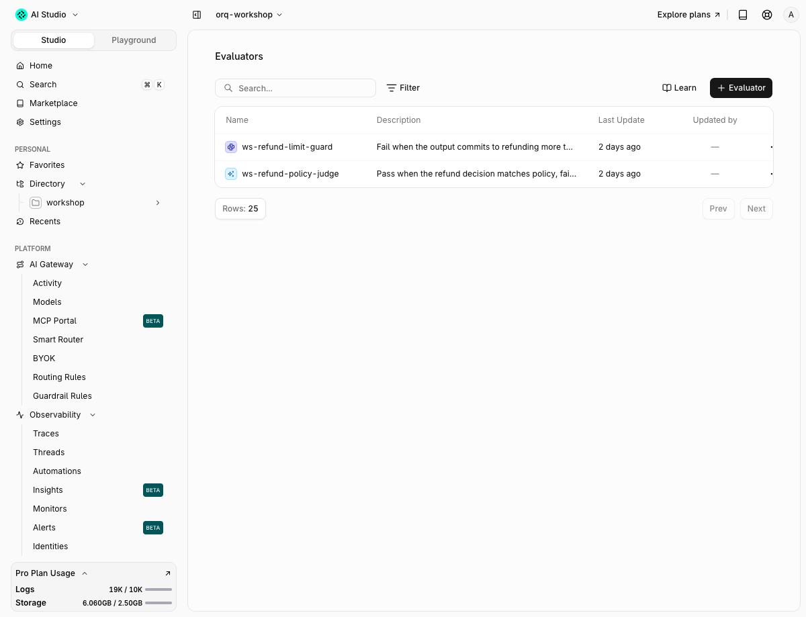

# 04 · Guardrails

!!! abstract "Factor 7: Contact humans with tool calls"
    A guardrail that blocks is the agent saying "I need a person". The gateway returns an error the app can catch, and the app opens the escalation path. The model never has to be prompted into asking for help.

| | |
|---|---|
| **Time** | 25 min |
| **Prerequisites** | module 00, `make seed` |
| **You will have** | PII replaced by placeholders before the provider sees it, an output guardrail that turns an over-limit refund promise into a human hand-off, and a gateway rule that guards calls which carry no guardrail config at all. |

## Why

The refund agent touches customer data and money. Two things must never leave the building: the customer's contact details on their way to a provider, and a promise the policy forbids on its way to the customer. Both checks live in the gateway, so they hold for every client, every framework and every prompt version, and every decision is a span on the trace.

## The one concept to understand first

Three controls travel on the same request, and they differ in what they are allowed to do ([PII redaction plugin](https://docs.orq.ai/docs/ai-gateway/features/plugins/pii-redaction), [guardrails](https://docs.orq.ai/docs/ai-gateway/configuration/guardrails), [guardrail rules](https://docs.orq.ai/docs/ai-gateway/configuration/guardrail-rules)):

| Field | Does | On failure |
|---|---|---|
| `plugins: [{"id": "pii_redaction"}]` | Rewrites content. Placeholders out, originals restored on the way back. | `on_failure`: `block` (default) or `passthrough` |
| `guardrails: [{"id": ..., "execute_on": ...}]` | Judges content with an evaluator. Pass or block, never rewrite. | Always blocks. On the router the block is HTTP `400 guardrail_error`; on agents and deployments it is `422`. |
| Guardrail rule (Studio or API) | Same as `guardrails`, attached by a CEL match on `model`, `metadata`, `identity`, `project` or `headers`. | Same. The request body carries nothing. |


```python
client.responses.create(
    model=settings.model, instructions=INSTRUCTIONS, input=messages, tools=RESPONSES_TOOLS, store=False,
    extra_body={
        "plugins":    [{"id": "pii_redaction", "language": "en", "on_failure": "passthrough"}],
        "guardrails": [{"id": "01M21E87W6Y0GTS8MWZR6AG1VX", "execute_on": "output"}],
    },
)
```

`app/` does not change in this module. `run_turn` already forwards `extra_body` and `extra_headers`.

## Steps

Open `modules/04-guardrails/run.py`. Each step has a `TODO`. The complete version is `solution/run.py` (`make m04`).

### Step 1 · PII detection and redaction as an API

The note on `ord_a5` holds an email and a phone number. `orq.pii.detect`, `orq.pii.redact` and `orq.pii.restore` are the same three calls the plugin makes for you.

```bash
$ uv run python modules/04-guardrails/run.py
```

Expected output:

```text
[1] note     : Customer note: contact me at jane.doe@example.com or +31 6 1234 5678
[1] detect   : has_pii=True entities={'EMAIL_ADDRESS': 1, 'PHONE_NUMBER': 1}
[1] redact   : Customer note: contact me at <EMAIL_ADDRESS_1> or <PHONE_NUMBER_1>
[1] mappings : {'<EMAIL_ADDRESS_1>': 'jane.doe@example.com', '<PHONE_NUMBER_1>': '+31 6 1234 5678'}
[1] restore  : True
```

Same thing from the CLI:

```console
$ orq pii redact --text "contact me at jane.doe@example.com or +31 6 1234 5678" -o json
{
  "mappings": {
    "<EMAIL_ADDRESS_1>": "jane.doe@example.com",
    "<PHONE_NUMBER_1>": "+31 6 1234 5678"
  },
  "redacted_text": "contact me at <EMAIL_ADDRESS_1> or <PHONE_NUMBER_1>"
}
```

Detection runs on orq's own model, on orq infrastructure. Nothing is sent to a third party to find PII.

### Step 2 · The redaction plugin, per request

Fill in `PLUGIN` and run again. Three calls: one that shows the round trip, one seeded to over-redact, one with the fix.

```text
[2a] trace=6ebfa648d580ae9ec4a56bda56bac4bd tools=['lookup_order', 'get_policy', 'issue_refund']
[2a] answer: rned to the original payment method within **5–7 business days**.
The receipt will be sent to **jane.doe@example.com**.
[2a] pii.redact outcome=redacted requested=0 entities={'EMAIL_ADDRESS': 1, 'JOB_TITLE': 2, 'LOCATION': 1, 'ORGANIZATION': 1} placeholders=['<EMAIL_ADDRESS_1>', '<JOB_TITLE_1>', '<JOB_TITLE_2>', '<LOCATION_1>', '<ORGANIZATION_1>']
```

The customer reads their real address. The provider read `<EMAIL_ADDRESS_1>`: open the trace, the `pii.redact` span lists six placeholders and the `chat` span's stored input is the redacted form (`persist_redacted_to_traces` defaults to true). Notice the other five: the system prompt's "Lumen Goods", "NL warehouse" and job titles were redacted too. With no `entities` list the plugin redacts every type it knows.

The seeded failure is not the order id. `ord_a1` and `ord_a5` pass the detector untouched, and `lookup_order` gets the real id:

```text
[2b] trace=fb22cbe40b8262b147ef385d70ec7ecf tools=['lookup_order', 'get_policy'] args=[]
[2b] answer: The order shows delivery **70 days ago**. Because it is outside the 30-day window and the tracking reference provided does not match a valid carrier format, I c
[2b] pii.redact outcome=redacted requested=0 entities={'DATE_TIME': 1, 'IBAN_CODE': 1, 'JOB_TITLE': 2, 'LOCATION': 1, 'ORGANIZATION': 1} placeholders=[...]
```

What did disappear: "70 days ago" became `<DATE_TIME_1>` and the tracking reference `NL987654321` became `<IBAN_CODE_1>`. The model reasoned about a placeholder, and the restore left "70, days" behind. The fix is an explicit allowlist. Alone, `entities` is strict:

```python
strict = {**PLUGIN, "entities": ["EMAIL_ADDRESS", "PHONE_NUMBER", "PERSON"]}
```

```text
[2c] trace=d7ef946d9056cc29bf4911f1e815a772 tools=['lookup_order', 'get_policy', 'get_policy']
[2c] answer: The order shows as delivered **70 days ago**. Because it is outside the 30-day window, the tracking reference must be a valid PostNL format beginning with `3S` 
[2c] pii.redact outcome=redacted requested=3 entities={} placeholders=[]
```

### Step 3 · A Python guardrail on the output

`make seed` created the evaluator `ws-refund-limit-guard` (id `01M21E87W6Y0GTS8MWZR6AG1VX`, code in `app/refund_agent/guardrail_refund_limit.py`). It returns `False` when the answer commits to a refund above EUR 500. Attach it per request and make the model promise EUR 620 on `ord_a6` with the vulnerable instructions:

```text
[3] guardrail ws-refund-limit-guard = 01M2K90EKD55C0PVZZVRVPKQS5
[3] vulnerable: HTTP 400 guardrail_error trace=1e586c1518834018707f529c44751283
    body: {"message": "guardrail check failed: 01M2K90EKD55C0PVZZVRVPKQS5", "type": "guardrail_error", "param": null, "code": "guardrail_error", "failures": [{"id": "01M2K90EKD55C0PVZZVRVPKQS5", "stage": "output", "value": f
    -> hand-off: human review ticket, trace=1e586c1518834018707f529c44751283, failed=['01M2K90EKD55C0PVZZVRVPKQS5 stage=output outcome=condition_failed']
[3] fixed     : passed, answer: I'm sorry, but I can't provide that information. ...
[3] ord_a1    : passed, I've processed the refund for your desk lamp that flickers. ...
```

This is Factor 7. The model produced the forbidden sentence, the gateway refused to deliver it, and the app's `except` branch is where the human enters: the trace id goes on a review ticket, the customer gets "a colleague will confirm". No answer, no apology written by the model, no retry loop. The `failures` array names the evaluator, the stage and the outcome, so the ticket can say why.

On the router the block arrives as `openai.BadRequestError` (400). Agents and deployments return `422`, so `solution/run.py` catches both.

One detail in the code: these three calls pass `api="chat"`, so `run_turn` sends them to `/chat/completions` instead of the Responses endpoint the rest of the app uses. In 4.14.17 the gateway accepts a request-level `guardrails` field on `/responses` and ignores it: the same request that is blocked here returns 200 with the forbidden sentence. Guardrail **rules** (step 4) are enforced on both endpoints, which is one more reason to prefer them.

### Step 4 · System guardrails and a rule that needs no request changes

`orq_secret_detection` and `orq_pii_detection` ship with the workspace. No evaluator to create:

```text
[4] secret    : HTTP 400 orq_secret_detection stage=input categories=['github-pat']
[4] pii       : HTTP 400 guardrail_error reason=PII detected: email address
```

Now the same PII check as a rule. The rule is scoped to the `orq-workshop` project and matched by CEL on request metadata. The call carries no `guardrails`, only a tag:

```text
[4] rule      : ws-guardrail-rule-pii id=grl_01m2k9h7kvawf7xzrp43d32k43 project=01a082d7-b8cc-7c86-bfe8-83f9cb47688b cel=metadata["channel"] == "ws-guardrails"
[4] tagged    : HTTP 200 (project rule did not match: an all-projects key carries no project)
[4] rule      : ws-guardrail-rule-pii-ws id=grl_01m2k9hmyceg3vdzwch0bvdw0h project=<workspace> same cel
[4] tagged    : HTTP 400 guardrail_error (workspace rule matched)
[4] untagged  : HTTP 200 (rule does not match)
[4] disabled  : HTTP 200 (rule off)
[4] deleted   : grl_01m2k9h7kvawf7xzrp43d32k43 -> 204
[4] deleted   : grl_01m2k9hmyceg3vdzwch0bvdw0h -> 204
```

Read the two `tagged` lines. A project rule matches requests that belong to the project. A key minted with `orq setup --local` (module 00) is project-scoped, and with it the first rule blocks the tagged call (verified with the CLI's project credential: `orq request POST /v3/router/chat/completions --project orq-workshop` returned `400 guardrail_error`). The repo's demo key is workspace-wide, its requests carry no project, so the solution falls back to a workspace rule with the same metadata gate. The gate is the blast radius: only calls tagged `channel=ws-guardrails` are checked, everyone else's traffic is untouched. The run disables the rule, proves the tagged call passes again, then deletes both rules.

### Step 5 · Read the indicators on the span

```text
[5] spans of blocked trace 1e586c1518834018707f529c44751283:
    chat.openai                trace                  error      979 ms
    chat gpt-5.6-luna          span.chat_completion   ok         723 ms
    ws-refund-limit-guard      span.evaluator         ok         246 ms  passed=False outcome=condition_failed stage=output action=block
```

Open the trace in the Studio. The root span is red (the request failed), the model span is green (the provider answered), and a third span named after the evaluator carries the verdict. Since 4.14 every trace shows which guardrails and evaluators ran: look for the shield icon on the span row, and on the span itself the attributes `orq.guardrail.action=block`, `orq.evaluation.outcome=condition_failed`, `orq.evaluation.stage=output` and `gen_ai.evaluation.passed=false`. A plugin run shows as `pii.redact` and `pii.restore` spans with the placeholder count.

## With your coding agent

```bash
$ orq launch claude
```

Paste the prompt from `agent_prompt.md` in this module directory:

> Using the orq MCP tools, create a Python evaluator `ws-no-email-echo` whose `evaluate(log)` returns False when `log["output"]` contains an email address, with guardrail config enabled. Attach it as an output guardrail on the agent `ws-refund-agent` with `update_agent`, keeping its tools and knowledge base. Invoke the agent with "My email is jane.doe@example.com, what email do you have on file?" and show me the 422 body and the trace id. Do not change anything under `app/`.

## Proof



## Done when

- [ ] A trace in your workspace has `pii.redact` and `pii.restore` spans, and the answer contains the real email
- [ ] A trace has a `span.evaluator` span named `ws-refund-limit-guard` with `action=block`, and your terminal shows the `guardrail_error` body
- [ ] `orq_secret_detection` blocked a GitHub token on input
- [ ] `orq request GET /v2/guardrail-rules -o json` shows no `ws-` rule left (the run deletes them)
- [ ] You can say in one sentence what the app does when the guardrail blocks

## Gotchas

- On the router a blocked guardrail is HTTP `400` with `code: guardrail_error`, not the `422` the evaluator docs describe for agents and deployments. Catch `openai.APIStatusError` and read `body["failures"]`.
- Rule CEL treats `metadata` as a map: `metadata["channel"] == "x"` is valid, `metadata.channel` is rejected with `unknown function "channel"`. `model`, `identity`, `project` and `headers["..."]` are plain identifiers.
- In this run only top-level body `metadata` fed rule matching. `X-ORQ-METADATA-*` headers and `orq.metadata` reached the trace but did not match the rule.
- A workspace-wide rule with an empty expression matches every request in the workspace, and system guardrails fail closed. A detector outage then blocks all traffic. Always scope to a project or gate on metadata.
- The seeded regex guard blocks any sentence with "refund" and an amount above 500, including a refusal that names the amount. Wording decides. A judge with the policy text, or a check on the `issue_refund` tool result, is the better guard.
- `orq.guardrail_rules.list()` in SDK 4.14 fails on the `_id` field the API returns. The solution uses `GET /v2/guardrail-rules`. Project rules only appear when you pass `project_id`.
- Output guardrails do not run on streaming responses. Keep the refund agent non-streaming where enforcement matters.
- Request-level `guardrails` are ignored on `/v3/router/responses` (accepted, not enforced, no error) as of 4.14.17. Step 3 uses `api="chat"` for that reason; rules apply to both endpoints.
- Since orq API 4.14.17, `/v2/guardrail-rules` answers `403 not authorized for this endpoint` to the repo's workspace key (a legacy `workspace_jwt` service-account token). `entities.rules_api` retries the call through `orq request` with the `ORQ_API_KEY` your shell exported before `.env` overrode it, so log in with the CLI (`orq auth login`) and keep that key in the shell. A key minted by `orq setup --local` is a different kind and should not need the fallback; if you get the 403 with one, tell the instructor.

## New in orq 4.14

Every trace now shows which guardrails and evaluators ran on a span (the shield icon and the `orq.guardrail.*` attributes above). 4.13 added sampling and a monitor-only mode for system guardrails, and 4.12 made `orq_pii_detection` and `orq_secret_detection` available in every workspace without setup.

## Go further

The same `pii_redaction` config can be switched on for the whole workspace under Settings > Plugins, and a request can only make it stricter, never looser. `GET /v2/pii/capabilities` is the live catalog of entity types and regions.

Docs: [Guardrails](https://docs.orq.ai/docs/ai-gateway/configuration/guardrails), [Guardrail rules](https://docs.orq.ai/docs/ai-gateway/configuration/guardrail-rules), [PII redaction plugin](https://docs.orq.ai/docs/ai-gateway/features/plugins/pii-redaction), [Evaluators (guardrail error response)](https://docs.orq.ai/docs/ai-studio/optimize/evaluators), [Trace evaluations](https://docs.orq.ai/docs/ai-studio/observability/trace-evaluations).
