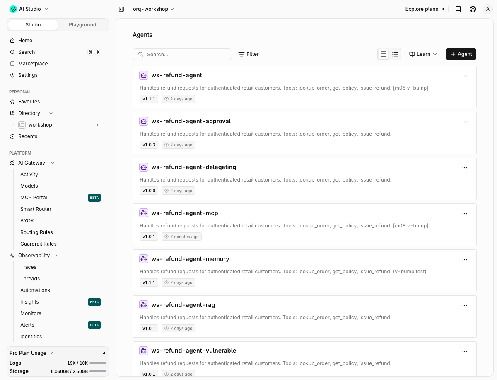

# 08 · Managed agents

!!! abstract "The agent lives in orq, your code executes the tools"
    The agent lives in orq. Your code is the tool executor: every `function_call` item comes back to you, you answer it, the conversation resumes server-side. One agent, three tools, eight iterations max.

| | |
|---|---|
| **Time** | 40 min |
| **Prerequisites** | modules 00 to 02, `make seed` |
| **You will have** | the refund agent invoked through the Responses API with a local tool loop, streamed, given memory, versioned and pinned by `@version`. |

## Why

Modules 01 to 07 kept the agent loop in `app/refund_agent/agent.py`. This module moves the loop to orq: instructions, model, tool schemas, iteration and time limits, knowledge base and memory are one entity with versions. The app shrinks to "execute this tool call and send the result back". That is the split the Responses API is built for, and it is what the Studio, the CLI and the coding-agent skills operate on.

## The one concept to understand first

A managed agent does not run your Python. When it decides to call `lookup_order`, the response comes back `status: completed` with a `function_call` output item and stops. You execute it, then continue the same response chain:

```python
r = orq.responses.create(model="agent/ws-refund-agent", input="Refund ord_a2 please")
call = r.output[0]                                   # type=function_call, name, arguments, call_id
result = dispatch(store, call.name, json.loads(call.arguments))
r = orq.responses.create(
    model="agent/ws-refund-agent",
    previous_response_id=r.id,                       # server-side state, no history resent
    input=[{"type": "function_call_output", "call_id": call.call_id, "output": json.dumps(result)}],
)
```


Match on `call_id`, not `id`. Server-side tools (memory, advisor, `current_date`) also emit a `function_call` item, followed by an `orq:<tool>` item carrying the result; those are not yours to answer. Every call returns `telemetry.trace_id`.

## Steps

Open `modules/08-managed-agents/run.py`. The loop in `run_agent` has two `TODO`s. The solution is in `solution/run.py`.

### Step 1 · Inspect the agent

```bash
$ orq agents retrieve ws-refund-agent -o json | jq '{key, version, model: .model.id, settings: {max_iterations: .settings.max_iterations, max_execution_time: .settings.max_execution_time, tool_approval_required: .settings.tool_approval_required, tools: [.settings.tools[] | {action_type, key, requires_approval}]}, knowledge_bases}'
$ make m08      # the solution; the starter prints the same block once its TODOs are filled in
```

Expected output:

```text
── Step 1 · Inspect the agent ─────────────────────────
agent    : ws-refund-agent v1.1.0 (live)
model    : openai/gpt-5.6-luna
limits   : max_iterations 8, max_execution_time 120s
approval : tool_approval_required=respect_tool
tools    : [('function', 'ws-lookup-order', 'S4GC7Z'), ('function', 'ws-issue-refund', '7NXF3X'), ('function', 'ws-get-policy', 'Z2QE66'), ('retrieve_knowledge_bases', 'Retrieve Knowledge Bases', '55XZ86'), ('query_knowledge_base', 'Query Knowledge Base', 'X018W4')]  (action_type, key, id suffix: the READ shape)
kb       : [{'knowledge_id': '01M2K8Y4HRF33KBXZVMTQVM6KB'}]
memory   : []
patch    : rejected, ValueError: Could not find discriminator field type in {'id': '01M2K8Y61FFSQ5BE3BV…
write    : settings.tools = [{'type': 'function', 'key': 'ws-lookup-order'}, ...]
next     : open Agents > ws-refund-agent in the Studio; the Versions tab is used in step 5
```

Reads and writes have different shapes. A GET returns tools as `{action_type, id, key, requires_approval}`; a create or update wants `{"type": "function", "key": "ws-lookup-order"}`. Inline function schemas are rejected: register the tool once (`orq tools create`), then reference it by key. Open the agent in the Studio (**Agents** > `ws-refund-agent`): the same instructions, the tool list, the limits, and a **Versions** tab.

### Step 2 · Invoke it and execute the tool calls

```text
── Step 2 · Invoke it and execute the tool calls ──────
question : Refund ord_a2 please, the dock does not fit.
tools    : lookup_order → get_policy → issue_refund
requests : 4 in 5.2s, cost $0.00008
answer   : Your refund of **€89** for the charging dock has been issued to the original payment method. It shou…
first    : 0a272823e64d604a68fd1f559e1a6ab1
last     : a82c9697d1495f27efaa20c265480682
next     : run `orq traces thread a82c9697d1495f27efaa20c265480682`; the last trace renders the whole conversation
```

Four requests, four traces: each Responses call is its own trace with an `agent.response` span and a `chat openai/gpt-5.6-luna` span. State is server-side, so the last trace's thread view is the conversation as the customer saw it; the tool calls and their results sit in the three traces before it:

```console
$ orq traces thread c4e68bf2a8a0e9814b9e08eb9dabb93c --slice -2:
<thread trace="c4e68bf2a8a0e9814b9e08eb9dabb93c" span="26b1f583bbd66a49" format="responses" model="gpt-5.6-luna" duration_ms="1398" tokens="1343">

<message index="0" role="user">
Refund ord_a2 please, the dock does not fit.
</message>

<message index="1" role="assistant">
Your refund of **€89** for the charging dock has been issued to the original payment method. It should arrive within **5–7 business days**.
</message>

</thread>
```

If a model confirms the order first and waits ("Would you like to proceed?"), the turn ends with two tool calls and no refund. The fixed instructions say the request is the confirmation; a prompt that asks for one needs a second turn before `issue_refund` shows up.

### Step 3 · Stream

`stream=True` returns an event stream. Text arrives as `response.output_text.delta` events; a `function_call` arrives as `response.function_call_arguments.delta` and `.done`. A prompt the agent answers with a tool call streams no text at all (luna fetches `get_policy` for "what is the refund window?"), so the step asks something the agent answers by itself.

```text
── Step 3 · Stream ────────────────────────────────────
events   : 17
first    : token at 0.82s
tokens   : ['Hello', '!', ' How', ' can', ' I', ' help']
text     : Hello! How can I help you today?
next     : the first token arrived well before the full text; that is what a chat UI renders
```

The CLI does the same: `orq agents stream ws-refund-agent --message '{"role":"user","parts":[{"kind":"text","text":"..."}]}'` (that endpoint is the older A2A shape and prints a deprecation warning from the SDK; prefer `orq responses create --model agent/ws-refund-agent --input '"..."'`).

### Step 4 · Memory

A memory store is an embedding-backed store of documents per `entity_id`. The agent reads and writes it through server-side tools, so it needs three things: the store attached (`memory_stores=["ws_refund_memory"]`), the tools in `settings.tools` (`retrieve_memory_stores`, `query_memory_store`, `write_memory_store`), and instructions that say when to save and when to query. The call then carries `memory={"entity_id": ...}`.

```text
── Step 4 · Memory ────────────────────────────────────
agent    : ws-refund-agent-memory
entity   : customer-user_001-1789512500
turn 1   : Nice to meet you, Jane Okafor—I’ll remember that you prefer store credit over card refunds.
turn 2   : Yes, Jane—I remember that you prefer store credit over card refunds.
trace 2  : 9b16877b2c0de9424a4ed024cf44f584
next     : open trace 2; expect retrieve_memory_stores and query_memory_store spans, then `orq memory-stores list-memories ws_refund_memory`
```

Two things the solution does deliberately. The store key is `ws_refund_memory`: memory store keys must match `^[A-Za-z]([A-Za-z0-9]*([._][A-Za-z0-9]+)*)?$`, so the `ws-` prefix is not allowed. And the memory goes on a copy, `ws-refund-agent-memory`, not on `ws-refund-agent`: once an agent has memory tools, every call without `memory.entity_id` is a `400 Memory entity ID is required`, which would break every other module that invokes `agent/ws-refund-agent`. Check the store: `orq memory-stores list-memories ws_refund_memory`.

### Step 5 · Versions and `@version` routing

`orq.agents.update(agent_key=, ..., version_increment="minor", version_description="...")` publishes a version. Invoke a pinned version with `agent/<key>@<version>`, an environment with `agent/<key>@<environment>`; no suffix means `latest`.

```text
── Step 5 · Versions and @version routing ─────────────
version  : ws-refund-agent already at v1.1.0 (bump skipped, idempotent)
call     : agent/ws-refund-agent@1.0.0        ok, trace 7a78a06c0065a70736d88491695a8904
call     : agent/ws-refund-agent@1.1.0        ok, trace 4ad271bc8ac4a57675fe2ae3d606d04c
call     : agent/ws-refund-agent@latest       ok, trace 72c0cca86acfce6b3ff22f09ee2281c9
call     : agent/ws-refund-agent@production   version @production not found for agent ws-refund-agent
next     : assign the production environment in Agents > ws-refund-agent > Versions, rerun, and @production resolves
```

Environments are assigned in the Studio: **Agents** > `ws-refund-agent` > **Versions** > the version's environment menu > `production`. Do it now and re-run: `@production` resolves. The bump changes only the description, so the agent behaves the same; the solution skips it on re-runs.

### Step 6 · The same from the CLI

```bash
$ orq responses create --model agent/ws-refund-agent --input '"One sentence: what is the refund window?"' -o json | jq '{trace: .telemetry.trace_id, text: .output[0].content[0].text}'
$ orq traces search --from 5m --to now -o json | jq '.data[] | select(.name == "ws-refund-agent") | .trace_id' | head -3
```

## With your coding agent

```bash
$ orq launch claude
```

Paste `agent_prompt.md`:

> Use the build-agent skill to create an agent `ws-refund-agent-v2` in path `orq-workshop/workshop` with the same instructions, model and function tools as `ws-refund-agent` (tools by key: `ws-lookup-order`, `ws-get-policy`, `ws-issue-refund`), plus the existing function tool `ws-escalate-to-human`. Add one line to the instructions: above the EUR 500 limit, call `escalate_to_human(order_id, reason)` and give the customer the ticket id. Then invoke it through the Responses API with `model="agent/ws-refund-agent-v2"` and input "refund ord_a6", execute the `function_call` items with `app.refund_agent.tools.dispatch` (answer `escalate_to_human` with a fake ticket id), continue with `previous_response_id` until the agent answers, and show me the trace with `orq traces thread <trace_id>`.

## Proof



## Done when

- [ ] `run.py` completes a refund with `tools=['lookup_order', 'get_policy', 'issue_refund']` and `orq traces thread <last trace>` shows the answer
- [ ] A stream printed its first token before the full answer
- [ ] `orq memory-stores list-memories ws_refund_memory` lists an entity with one document, and turn 2 recalled the name
- [ ] `orq agents retrieve ws-refund-agent -o json | jq .version` is `1.1.0` and `@1.0.0` still answers
- [ ] You can say which output item types your loop must answer and which it must not

## Gotchas

- `orq agents get` does not exist; it is `orq agents retrieve <key>`.
- Each `responses.create` is a new trace, also with `previous_response_id`. Search by agent name, or pass `thread={"id": ...}` to group them in the thread view.
- `tool_approval_required` and `requires_approval` exist on the agent, but through the Responses API they change nothing: function tools always come back to you (you are the approval), and a server-side tool with `requires_approval: true` still ran in our test. See `solution/stretch_factor7.py`.
- The agent's attached knowledge base (`ws-refund-policy`) is never searched in these traces; the agent uses `get_policy`. Module 09 covers why, and what retrieval looks like.
- `orq.agents.responses.create(agent_key=, message=, task_id=)` still works but the SDK marks it deprecated. Use `orq.responses.create(model="agent/<key>")`.

## New in orq 4.13

Agents can delegate: an `advisor` tool consults a second model mid-turn and a `sidekick` tool hands off a discrete task, each metered on its own span. Module 15 is that pattern on `ws-refund-agent-delegating`, down to the cost split in the trace. 4.12 added a configurable timeout per agent tool.

## Go further

- Module 15: advisor and sidekick on a copy of this agent, with the nested spans (`advisor` > `chat gpt-5.6-sol`, `sidekick` > `chat gpt-5.4-nano`) and what each costs.
- `solution/stretch_factor7.py`: a human gate in the tool loop plus an `escalate_to_human` tool, on `ws-refund-agent-approval`. Above the limit the agent opens ticket `HR-ord_a6-0001` instead of writing "we will route you".
- Docs: [Run agents](https://docs.orq.ai/docs/ai-studio/ai-engineering/run-agents), [Responses API](https://docs.orq.ai/docs/ai-gateway/features/responses-api), [Memory stores](https://docs.orq.ai/docs/ai-studio/ai-engineering/memory-stores), [Advisor and Sidekick](https://docs.orq.ai/docs/ai-studio/cookbooks/common-architecture/advisor-and-sidekick), [Build agents](https://docs.orq.ai/docs/ai-studio/ai-engineering/build-agents), [Create tools](https://docs.orq.ai/docs/ai-studio/ai-engineering/create-tools), [Create response API](https://docs.orq.ai/reference/responses/create-response).
