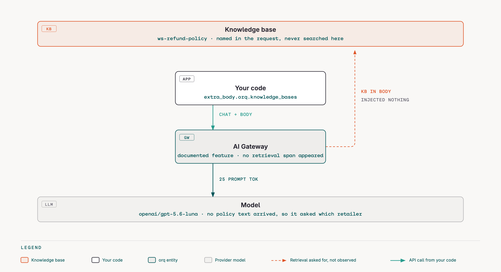
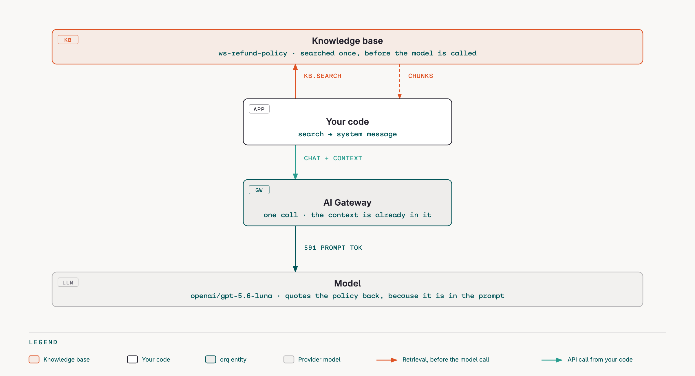
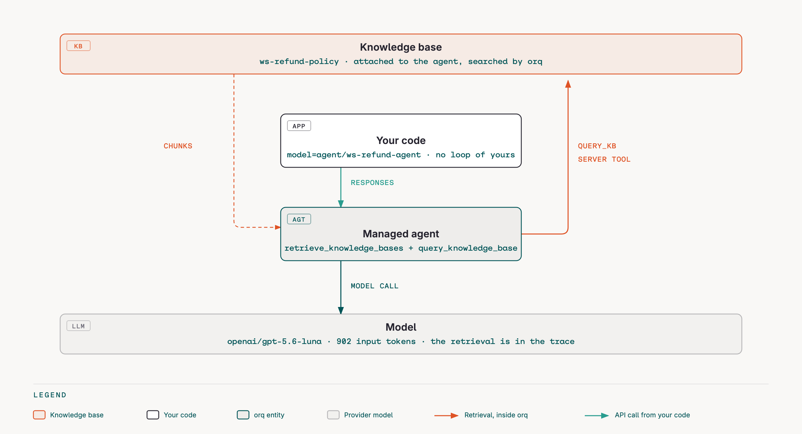
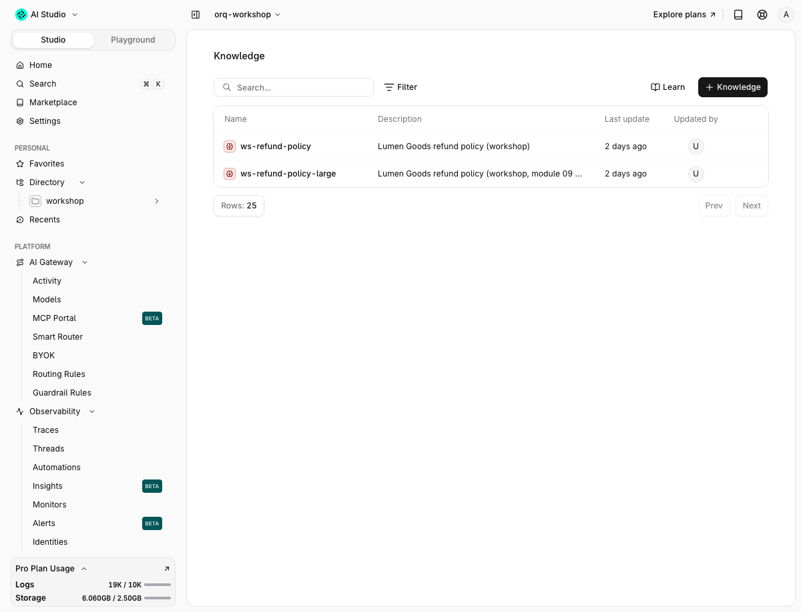

# 09 · Knowledge base and RAG

!!! abstract "Retrieval decides what the model sees"
    Retrieval decides what the model sees. Chunking decides what retrieval can find. Both are settings you own, and the cheapest RAG is the one that searches before the model call instead of asking the model to search.

| | |
|---|---|
| **Time** | 35 min |
| **Prerequisites** | modules 00 to 02, `make seed` |
| **You will have** | the refund policy searched three ways, re-chunked two ways, wired into the local agent in place of `get_policy`, pre-fetched into a plain completion, and searched by a managed agent through its knowledge tools. |

## Why

`get_policy(topic)` works because the policy is four short files with known names. Real policy is hundreds of pages that change weekly. A knowledge base turns "which file" into "which chunks match this question", and the same search is available to your code, to the gateway, to managed agents and to the coding-agent skills. This module shows where retrieval can run and what each option puts in the trace.

## The one concept to understand first

A knowledge base is datasources, chunks and one embedding model. Search returns chunks with a score; `search_type` picks vector, keyword or hybrid; `rerank_config` reorders; `agentic_rag_config` lets a model rewrite the query first. What you do with the chunks is the RAG design decision:

```python
matches = orq.knowledge.search(knowledge_id=kb, query=q, top_k=3, search_type="hybrid_search",
                               search_options={"include_scores": True, "include_metadata": True}).matches
context = "\n\n".join(m.text for m in matches)          # fetched before the model call
client.chat.completions.create(model=..., messages=[{"role": "system", "content": f"Answer only from:\n{context}"}, ...])
```


## Steps

Open `modules/09-knowledge-base-rag/run.py`. The solution is in `solution/run.py`.

### Step 1 · Inspect the seeded knowledge base

```bash
$ orq knowledge-bases list -o json | jq -c '.data[] | select(.key | startswith("ws-")) | {key, id: ._id, model}'
{"key":"ws-refund-policy","id":"01M2K8Y4HRF33KBXZVMTQVM6KB","model":"openai/text-embedding-3-large"}
$ orq knowledge-bases retrieve ws-refund-policy -o json | jq -c '{key, id: ._id, model, retrieval_settings}'
{"key":"ws-refund-policy","id":"01M2K8Y4HRF33KBXZVMTQVM6KB","model":"openai/text-embedding-3-large","retrieval_settings":{"retrieval_type":"hybrid_search","threshold":0,"top_k":5}}
$ uv run python modules/09-knowledge-base-rag/run.py
```

Expected output (solution, step 1):

```text
── Step 1 · Inspect the seeded knowledge base ─────────
kb       : ws-refund-policy (01M2K8Y4HRF33KBXZVMTQVM6KB)
model    : openai/text-embedding-3-large
settings : {'retrieval_type': 'hybrid_search', 'top_k': 5, 'threshold': 0.0}
file     : abuse_patterns.md          chunks=1 status=completed completed=1 failed=0 queued=0
file     : post_window_exceptions.md  chunks=1 status=completed completed=1 failed=0 queued=0
file     : refund_basics.md           chunks=1 status=completed completed=1 failed=0 queued=0
file     : shipping_and_scope.md      chunks=1 status=completed completed=1 failed=0 queued=0
next     : open https://my.orq.ai > Knowledge Bases > ws-refund-policy > Retrieval playground and type the step 2 query
```

One chunk per file: `chunk_size` 300 is in tokens, and each policy file is under 300 tokens. In the Studio open **Knowledge Bases** > `ws-refund-policy` > **Retrieval playground** and type the step 2 query; the same chunks and scores come back.

### Step 2 · Three search modes, with and without a reranker

```text
── Step 2 · Three search modes, with and without a reranker ──
query    : opened electronics after 20 days, can I return?
hybrid   : 0.654 # Post-window exceptions | 0.619 # Shipping and scope | 0.615 # Refund basics
vector   : 0.654 # Post-window exceptions | 0.619 # Shipping and scope | 0.615 # Refund basics
keyword  : 1.000 # Refund basics | 0.501 # Abuse patterns
rerank   : {'search_score': 0.653556764125824} # Post-window except | {'search_score': 0.6187750101089478} # Shipping and scope | {'search_score': 0.6148313283920288} # Refund basics
verdict  : no rerank_score: no rerank model is enabled in this workspace, so the gateway skipped reranking
next     : the same search from the CLI: orq knowledge-bases search ws-refund-policy --query '...' --search-type keyword_search
```

Read the three rankings against each other. Keyword search puts `refund_basics` at 1.000 because the query's words are in that file; vector search puts `post_window_exceptions` first because the question is about elapsed time, which no shared vocabulary would catch; hybrid runs both and the engine fuses the two lists into one ranking.

The scores are not comparable across modes. Keyword scores come from a text-match calculation, vector and hybrid scores from embedding distance, so a keyword `1.000` and a hybrid `0.654` say nothing about each other. Compare within a mode, and check what a mode actually scores before setting a threshold against it. [How retrieval works](https://orq-ai.github.io/orq-workshop/reference/rag/) has the full pipeline, the `top_k` versus rerank `top_k` split, and the internal-versus-external division of labour.

Read step 1's `model` line: the seeded base is embedded with `openai/text-embedding-3-large`. That is deliberate. In September 2026 every vector or hybrid search on a base embedded with `openai/text-embedding-3-small` returned HTTP 500 in this workspace (keyword search worked), so `EMBEDDING_MODEL` defaults to the large model and the solution keeps a fallback: if the seeded base fails vector search, it re-embeds the same documents as `ws-refund-policy-large` and compares. Rerank has no score column because no rerank model is enabled here; enable one under **Models** and the `rerank_score` appears.

The CLI does the same search:

```bash
$ orq knowledge-bases search ws-refund-policy --query "opened electronics after 20 days, can I return?" --search-type hybrid_search --top-k 2 --search-options '{"include_scores": true, "include_metadata": true}' -o json | jq -c '.matches[] | {id, scores, metadata, text: .text[:50]}'
{"id":"chunk_01M2K8Y5BYXYS89DS09D6G1N70","scores":{"search_score":0.653556764125824},"metadata":{"datasource_id":"01M2K8Y59641J8B3732VGA96AT","topic":"post_window_exceptions"},"text":"# Post-window exceptions

Refunds outside the 30-d"}
{"id":"chunk_01M2K8Y5N894T40JNKG3TY6WD6","scores":{"search_score":0.6187750101089478},"metadata":{"datasource_id":"01M2K8Y5HS9DW37BD2QZWGTQGJ","topic":"shipping_and_scope"},"text":"# Shipping and scope

Lumen Goods ships from a sin"}
```

`metadata.topic` is the field the seed attached to every chunk; `filter_by={"topic": {"eq": "refund_basics"}}` restricts a search to it.

### Step 3 · Chunking is the lever

`orq.chunking.parse` is a pure function: text in, chunks out, nothing stored. Compare strategies before you rebuild a knowledge base.

```text
── Step 3 · Chunking is the lever ─────────────────────
file     : post_window_exceptions.md (1034 chars)
chunks   : recursive 1; first='# Post-window exceptions\n\nRefunds outside the 30-day window '
chunks   : sentence  3; first='# Post-window exceptions\n\nRefunds outside the 30-day window '
chunks   : semantic  4; first='# Post-window exceptions\n\nRefunds outside the 30-day window '
next     : nothing was stored; pick a strategy, then rebuild the datasource with it
```

With one chunk per file, every search returns whole documents and the score is a document score. Sentence chunks (120 tokens) would let "tracking reference format" match the bullet that defines it instead of the whole exceptions page. `semantic` needs an `embedding_model` and splits on topic shifts.

### Step 4 · The local agent reads policy from the knowledge base

`chat(..., policy_fn=...)` swaps `get_policy`'s implementation without touching the tool schema. The model still calls `get_policy(topic)`; the function now searches the knowledge base for the topic and returns the chunks as `text`, `source: "kb"`.


```text
── Step 4 · The local agent reads policy from the KB ──
question : Refund ord_a3 please, I changed my mind.
answer   : I’m unable to refund ord_a3 because it was delivered more than 30 days ago, and “changed my mind” is…
tools    : lookup_order → get_policy → get_policy
trace    : 4af13fddf056e91f657f5b79f0e89e67
next     : the trace shows only chat spans; knowledge.search is a separate API call, not a span in the gateway trace
```

No retrieval span appears: the gateway traces the model calls it proxies, and `knowledge.search` is a separate API call. To see retrieval inside the trace, either instrument it yourself (module 02, `TRACING=otel`) or let orq run it (steps 5c and 6).

### Step 5 · Pre-fetch the context

Three ways to put policy in front of the model without a tool round-trip.







```text
── Step 5a · Gateway-side retrieval (orq.knowledge_bases) ──
question : I opened my electronics 20 days ago, can I still return them? Quote the policy.
tokens   : prompt_tokens=25
answer   : 'Which retailer’s policy should I check? Please provide the store/website and your country or region—'
trace    : 97d2e8fdaabb0bf095bde649c5f38406
next     : compare prompt_tokens with 5b; a count this low means no policy text was injected
── Step 5b · Pre-fetched in code ──────────────────────
question : I opened my electronics 20 days ago, can I still return them? Quote the policy.
tokens   : prompt_tokens=591
answer   : 'Yes—if the order was delivered 20 days ago, it is within the 30-day refund window. The policy states:\n\n> “A customer is entitled to a refund on an order when al'
trace    : 8fd6c17f2911cc896242ca8d4a880a38
next     : the difference in prompt_tokens is the policy text; that is pre-fetching in five lines
── Step 5c · The managed agent searches its own KB ────
agent    : agent/ws-refund-agent
question : Can I return an item that was damaged in transit 45 days after delivery? What evidence do you need?
tokens   : input_tokens=902
items    : reasoning → message
answer   : 'Please provide your order ID so I can check it. For a damage claim 45 days after delivery, you’ll need verifiable evidence such as the tracking reference and cl'
trace    : 43b5633b1e3c9e93c61b1570410a18f2
next     : the orq:query_knowledge_base item is the retrieval; open the trace to see it as a span
```

- 5a is the documented gateway feature: `extra_body={"orq": {"knowledge_bases": [{"knowledge_id": ..., "top_k": 3, "search_type": "hybrid_search"}]}}` on a plain `chat.completions` call. In this workspace it injected nothing: 25 prompt tokens, a generic answer, no retrieval span. We tried `orq.knowledge_bases`, top-level `knowledge_bases`, `/v2` and `/v3`, two knowledge bases; a control prompt that must answer `NO CONTEXT` without context answered `NO CONTEXT` every time.
- 5b is five lines of code and works everywhere: search, then a system message. 591 prompt tokens, an answer that quotes the policy.
- 5c is the managed version. A knowledge base attached to an agent is only searched if the agent also has the `retrieve_knowledge_bases` and `query_knowledge_base` server tools. `ws-refund-agent-rag` is a copy of the refund agent with those tools instead of `get_policy`; the `orq:query_knowledge_base` output item carries the query the agent wrote, the chunk, the file name and the score. The seeded `ws-refund-agent` has the knowledge base attached but not the tools, so it never searches it.

### Step 6 · Agentic RAG

```text
── Step 6 · Agentic RAG ───────────────────────────────
query    : my thing broke, what now
matches  : 3
ranking  : 0.544 # Shipping and scope | 0.543 # Post-window exceptions | 0.537 # Abuse patterns
next     : the response keys are still just 'matches'; the refined query is not exposed by the API
```

`agentic_rag_config={"model": ...}` on a search lets a model rewrite a vague query ("my thing broke, what now") before retrieval and grade the results. The response shape does not change, so the rewritten query is not visible here; the Studio knowledge base settings expose the same toggle with a grading strictness.

### Step 7 · An external knowledge base

orq can front a retrieval API you already run: a vector database you cannot move (Weaviate and Pinecone have documented configurations), or any search endpoint of yours. The contract is one endpoint, the `api_url` you register: orq POSTs `{query, top_k, threshold, filter_by, search_options, rerank_config}` to it and expects `{"matches": [{id, text, metadata, scores: {search_score, rerank_score}}]}` with scores in 0 to 1, authenticated with `Authorization: Bearer <api_key>`. `app/edge.py` implements it over the four policy files with keyword scoring, in the same process that receives module 14's webhooks.


orq's servers make the call, so the endpoint must be public HTTPS (loopback and private addresses are rejected). Two ways to get there: a tunnel to your laptop, or the instance the instructor hosts for the room (`make edge-docker` on any host):

```bash
$ make edge                                   # terminal 1: http://127.0.0.1:8001
$ npx localtunnel --port 8001                 # terminal 2 -> https://<random>.loca.lt, into WS_EDGE_URL in .env
$ curl -s -X POST $WS_EDGE_URL/search -H "authorization: Bearer $WS_WEBHOOK_SECRET" -H 'content-type: application/json' \
    -d '{"query":"damaged in transit after 45 days","top_k":2}' | jq -c '.matches[] | {id, scores, metadata}'
{"id":"ext_post_window_exceptions","scores":{"search_score":0.75},"metadata":{"topic":"post_window_exceptions"}}
{"id":"ext_refund_basics","scores":{"search_score":0.25},"metadata":{"topic":"refund_basics"}}
```

With `WS_EDGE_URL` set, the step registers `ws-refund-policy-ext` (`type: external`, `external_config: {name, api_url: <WS_EDGE_URL>/search, api_key}`, `entities.ensure_external_knowledge_base`) and runs the same `knowledge.search` you used in step 2 against it. orq calls your `/search`, your terminal 1 prints the query, and the matches come back through the same API:

```text
[7] external KB ws-refund-policy-ext 01M2KDXAHZE2Y1XH5WWC6CAQGJ -> https://wide-onions-write.loca.lt/search: 3 matches
    0.750 ext_post_window_exceptions   # Post-window exceptions
    0.250 ext_refund_basics            # Refund basics
    0.250 ext_shipping_and_scope       # Shipping and scope
    the same search from the CLI: orq knowledge-bases search 01M2KDXAHZE2Y1XH5WWC6CAQGJ --query 'damaged in transit after 45 days' --top-k 2
```

The external knowledge base attaches to agents and deployments exactly like the managed one (step 5c). What changes is the division of labour: chunking, embeddings, metadata filters and the search itself are yours now, but orq still cuts the results to `top_k`, applies the threshold and reranks them before handing them back. You own retrieval; the platform still owns ranking. It waits at most 50 s and then answers the caller `504`; a non-2xx from your endpoint is passed through as it is, and anything else becomes a `502`. [How retrieval works](https://orq-ai.github.io/orq-workshop/reference/rag/) lays the two engines side by side. Without `WS_EDGE_URL` the step prints the contract and stops.

## With your coding agent

```bash
$ orq launch claude
```

Paste `agent_prompt.md`:

> Use the manage-knowledge-base idea with the orq Python SDK (`app.refund_agent.client.make_orq`): write a short policy doc `modules/09-knowledge-base-rag/warranty.md` (Lumen Goods gives a 24-month warranty on tech accessories and 12 months on lighting, claims go through support, not refunds), add it as a new datasource `warranty.md` to the knowledge base `ws-refund-policy-large` using `orq.chunking.parse` (recursive, chunk_size 300, chunk_overlap 40) and `orq.knowledge.create_chunks` with `metadata={"topic": "warranty"}`, poll `orq.knowledge.retrieve_processing_status` until `total_queued` is 0, then run `orq.knowledge.search` for "warranty length" with `search_type="hybrid_search"` and `search_options={"include_scores": True, "include_metadata": True}` and show me the top match with its score and metadata.

## Proof



## Done when

- [ ] `orq knowledge-bases search ws-refund-policy --query "..." --search-type keyword_search` and `vector_search` return different top chunks for the step 2 query
- [ ] You can say why a knowledge base embedded with `text-embedding-3-small` returned 500 on hybrid search in this workspace, and what the fix is
- [ ] `run.py` step 4 prints `source: kb` policy in the tool result (add a print in `kb_policy`) and the refund for `ord_a3` is refused
- [ ] Trace `e3c4e4001f3f8787b5b7b74712449189` (or your own from step 5c) shows `orq:query_knowledge_base` with a score in `orq traces thread`
- [ ] The external stub answers `curl` with a `matches` array

## Gotchas

- Vector and hybrid search return `500 internal_error` on a knowledge base embedded with `openai/text-embedding-3-small`; the same chunks with `openai/text-embedding-3-large` search fine. That is why `EMBEDDING_MODEL` defaults to the large model and why this module keeps a second knowledge base. If you inherit a workspace seeded before that change, re-embed: `make reset && make seed`, or keep working against `ws-refund-policy-large`.
- `orq_ai_sdk 4.14.14`: `orq.knowledge.list_datasources` sends `limit=50.0` and the API rejects the float. The solution uses the REST endpoint for that one call. `search_options.include_metadata` shows `metadata.topic` through the CLI and REST; the SDK model drops it.
- All eleven rerank models are `enabled: false` here. `rerank_config` with a disabled model is silently ignored. Enable one under **AI Gateway** > **Models** before you compare.
- `orq knowledge-bases list -o json` returns `{data, has_more, object}`, not a bare array: iterate `.data[]`. the solution only creates a `ws-refund-policy-large` copy when the seeded base fails vector search.
- Gateway-side retrieval (`orq.knowledge_bases` on `chat.completions`) did not inject context in this workspace. Verify with `usage.prompt_tokens` before you trust it, not with the answer text.

## New in orq 4.14

The Chunking API (`orq.chunking.parse`) exposes seven strategies (`token`, `sentence`, `recursive`, `semantic`, `agentic`, `fast`, `late`) as a stateless call, so chunking can be tuned in a script before a datasource is rebuilt. Knowledge base retrieval settings (search type, threshold, top_k, rerank, agentic RAG) can be overridden per request with `retrieval_config`.

## Go further

- `app/edge.py`: the `/search` contract in 20 lines. Point it at a real index (Weaviate, Pinecone, pgvector) instead of keyword scoring and nothing on the orq side changes.
- Docs: [Knowledge bases](https://docs.orq.ai/docs/ai-studio/ai-engineering/knowledge-bases), [Search API](https://docs.orq.ai/reference/knowledge-bases/search-knowledge-base), [Knowledge bases via AI Gateway](https://docs.orq.ai/docs/ai-gateway/features/knowledge-bases), [External knowledge bases](https://docs.orq.ai/docs/ai-studio/ai-engineering/external-knowledge-bases), [Chunking guide](https://docs.orq.ai/docs/ai-studio/ai-engineering/chunking), [Chunking API](https://docs.orq.ai/reference/chunking/parse-text).
