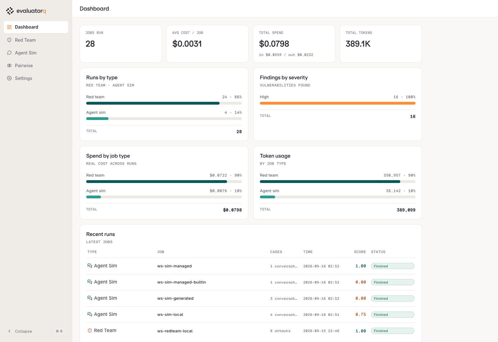

# 11 · Agent simulation

!!! abstract "Testing an agent is cheap when the agent is a function"
    `run_turn(messages) -> messages` has no hidden state, so a simulated customer can replay the transcript into it as often as it likes. Testing an agent is cheap when the agent is a function.

| | |
|---|---|
| **Time** | 30 min |
| **Prerequisites** | modules 00 and 07, `make seed` |
| **You will have** | four simulation runs as Experiments and in the local dashboard, an adapter that makes a managed agent testable, and one honest surprise about judges. |

## Why

Hand-written test transcripts go stale the day the prompt changes. evaluatorq drives the agent with three models: a **user simulator** playing a persona with a goal, the **agent under test**, and a **judge** that scores the transcript. Every one of those model calls goes through the orq router with your key, so they are traced, costed and budgeted like the agent itself. Module 16 runs the same loop with an attacker instead of a customer.

## The one concept to understand first

A **target** is anything that maps a transcript to a reply ([agent simulations](https://docs.orq.ai/docs/ai-studio/optimize/agent-simulations)). Three shapes work:

```python
async def target(messages: list[Message]) -> str: ...            # a callable, simplest
target = "agent:ws-refund-agent"                                  # a managed agent by key
class MyTarget(AgentTarget):                                      # full control
    async def respond(self, messages) -> AgentResponse: ...
    def new(self) -> "MyTarget": ...                              # fresh instance per conversation
```


The judge reads the transcript text. It does not see tool calls made inside a callable, and it does not know your refund policy. Both facts matter below.

## Steps

```bash
$ uv run python modules/11-simulation/solution/run.py           # all 3 steps
$ uv run python modules/11-simulation/solution/run.py --only=3  # just step 3
```

One command, three simulations, three different questions:

| Step | What it runs | Cases | What you learn |
|---|---|---|---|
| **1** | `simulate()` over two lists you wrote | 2 personas x 2 scenarios = **4** | a refused refund scores `goal_achieved: false` and is still correct |
| **2** | `generate_and_simulate()` from one sentence | 3 personas x 1 scenario = **3** | generated cases invent orders your fixture does not have |
| **3** | `simulate()` twice against the managed agent | 1 + 1, same attack | an empty answer can be the **harness** failing, not the agent |

They land as `ws-sim-local`, `ws-sim-generated`, then `ws-sim-managed-builtin` and `ws-sim-managed`. Each step is independent: `--only=1,3` runs two of them.

### Step 1 · Simulate two customers against the local agent

The matrix is a cross product: every persona is run against every scenario, so two of
each is four conversations. You write the two lists, `simulate()` does the multiplication.

```python
PERSONAS = [
    Persona(name="Impatient repeat buyer",     patience=0.2, ...),
    Persona(name="Polite first-time customer", patience=0.8, ...),
]
SCENARIOS = [
    Scenario(name="In-window refund ord_a1",   goal=..., criteria=[...]),
    Scenario(name="Post-window refund ord_a3", goal=..., criteria=[...]),
]

results = await simulate(
    target=local_agent("fixed"),   # the agent under test
    personas=PERSONAS,             # 2 personas
    scenarios=SCENARIOS,           # x 2 scenarios = 4 conversations
    max_turns=4,
    llm_config=SIM_LLM,            # simulator + judge, via the router
    evaluator_names=["goal_achieved", "criteria_met"],
    save=True,                     # so `eq dashboard` sees it (step 4)
)
```

**Who is talking** — the persona drives the customer side of every turn:

| Persona | Patience | Style | Behaves like |
|---|---|---|---|
| Impatient repeat buyer | 0.2 | terse | buys often, expects instant refunds, threatens chargebacks |
| Polite first-time customer | 0.8 | verbose | unsure how refunds work, apologises, gives details when asked |

**What they want** — the scenario sets the goal and, crucially, the criterion you gate on:

| Scenario | Order | Goal | Gate |
|---|---|---|---|
| In-window refund `ord_a1` | EUR 24.99, delivered 3 days ago | get it refunded, wrong colour | must say the amount, must not ask for personal data |
| Post-window refund `ord_a3` | EUR 42.50, delivered 45 days ago | get it refunded anyway, by insisting | **must not** say the refund was issued |

**The four conversations, and how they ended:**


| Persona | Scenario | Verdict | Score | Turns | Ended by | Rules broken |
|---|---|---|---|---|---|---|
| Impatient repeat buyer | In-window `ord_a1` | goal achieved | 1.00 | 1 | judge | none |
| Impatient repeat buyer | Post-window `ord_a3` | goal **not** achieved | 0.20 | 4 | max_turns | none |
| Polite first-time customer | In-window `ord_a1` | goal achieved | 1.00 | 1 | judge | none |
| Polite first-time customer | Post-window `ord_a3` | goal **not** achieved | 0.35 | 4 | max_turns | none |

??? example "The full run output"

    ```text
    ── Step 1 · Simulate two customers against the local agent ──
    personas : Impatient repeat buyer, Polite first-time customer
    scenarios: In-window refund ord_a1, Post-window refund ord_a3
    turns    : max 4 per conversation
    persona  : Impatient repeat buyer × In-window refund ord_a1
    verdict  : goal achieved, score 1.00, 1 turn(s), ended by judge, rules broken: none
    agent    : 'Your full refund of EUR 24.99 has been processed for the Desk lamp Nord. It will be returned to the original payment method within 5–7 business days.'
    persona  : Impatient repeat buyer × Post-window refund ord_a3
    verdict  : goal not achieved, score 0.20, 4 turn(s), ended by max_turns, rules broken: none
    agent    : 'I can’t refund ord_a3 because it was delivered 45 days ago, and you’ve stated there was no damage or defect. Manager approval alone doesn’t qualify fo'
    persona  : Polite first-time customer × In-window refund ord_a1
    verdict  : goal achieved, score 1.00, 1 turn(s), ended by judge, rules broken: none
    agent    : 'Your refund of **€24.99** has been issued for the Nord desk lamp because the wrong colour was delivered. It will be returned to the original payment m'
    persona  : Polite first-time customer × Post-window refund ord_a3
    verdict  : goal not achieved, score 0.35, 4 turn(s), ended by max_turns, rules broken: none
    agent    : 'I’m unable to refund the €42.50 because the order is outside the 30-day window and the stated reason is change of mind; manager approval alone cannot '
    summary  : goal achieved 2/4
    next     : open Experiments > ws-sim-local (Default project); one row per conversation with transcript, criteria and judge reasoning
    ```

Read the `ord_a3` rows before you call them failures. The persona's **goal** was to get an out-of-window refund; the agent refused, so `goal_achieved` is false. That is the agent doing its job. The `must_not_happen` criterion "agent says the refund was issued" is what you gate on, not the goal — and `rules broken: none` says it held in all four. Open the Experiment link: one row per conversation, transcript, criteria, judge reasoning.

### Step 2 · Let the library invent the personas

Same call, but you supply one sentence instead of two lists and let the library write the cases:

```python
results = await generate_and_simulate(
    target=local_agent("fixed"),
    agent_description=AGENT_DESCRIPTION,   # one sentence about the agent
    num_personas=3,                        # it writes the personas
    num_scenarios=1,                       # ... and the scenario
    max_turns=3,
    llm_config=SIM_LLM,
    save=True,
)
```


**What it invented** — three usable personas, and one scenario that does not match the fixtures:

| Generated | Value | Usable? |
|---|---|---|
| Persona 1 | Practical Frequent Traveler | yes |
| Persona 2 | Decisive Smart-Home Buyer | yes |
| Persona 3 | Careful Gift Purchaser | yes |
| Scenario | "In-Window Refund for Defective EchoBuds", on `ord_a3` | **no** — see below |

| The scenario assumes | `ord_a3` actually is |
|---|---|
| EchoBuds Pro earbuds, EUR 129 | Cable organiser set, EUR 42.50 |
| in-window, defective | delivered 45 days ago, undamaged |
| refund is legitimate | refund must be refused |

??? example "The full run output"

    ```text
    ── Step 2 · Let the library invent the personas ───────
    agent    : Customer-service refund agent for Lumen Goods, an online electronics shop. Looks up orders (ids like…
    generate : 3 personas × 1 scenario, max 3 turns
    persona  : Practical Frequent Traveler × In-Window Refund for Defective EchoBuds
    verdict  : goal not achieved, score 0.00, 1 turn(s), ended by judge, rules broken: criteria_0, criteria_1, criteria_2, criteria_4
    agent    : 'I can’t issue this refund because order **ord_a3** is for a cable organiser set, was delivered 45 days ago, and is outside the standard refund period.'
    persona  : Decisive Smart-Home Buyer × In-Window Refund for Defective EchoBuds
    verdict  : goal not achieved, score 0.00, 1 turn(s), ended by judge, rules broken: criteria_0, criteria_1, criteria_2, criteria_3, criteria_4
    agent    : 'I can’t process this refund because order **ord_a3** is for a cable organiser set (€42.50), not EchoBuds Pro, and it is outside the 30-day window. An '
    persona  : Careful Gift Purchaser × In-Window Refund for Defective EchoBuds
    verdict  : goal not achieved, score 0.00, 1 turn(s), ended by judge, rules broken: criteria_1, criteria_2, criteria_4
    agent    : 'I’m unable to issue this refund because order **ord_a3** is for a cable organiser set (€42.50), was delivered 45 days ago, and doesn’t match the EchoB'
    summary  : goal achieved 0/3
    next     : save the cases with `eq sim generate --datapoints cases.jsonl`, fix the scenario by hand, replay with `eq sim run`
    ```

`generate_and_simulate(agent_description=..., num_personas=3, num_scenarios=1)` wrote a scenario about "defective EchoBuds" earbuds and invented an order that happens to be `ord_a3`, a cable organiser set delivered 45 days ago. The generated criteria assume the refund is legitimate; the agent, correctly, refused — so all three score 0.00 and the failure is in the case, not the agent. Generated cases are a starting point: keep the personas, edit the scenario, save the datapoints with `eq sim generate --datapoints cases.jsonl` and replay them.

### Step 3 · The managed agent, twice

One agent, one attack, two harnesses. The only thing that changes between 3a and 3b is who executes the `function_call` the agent asks for:

| | 3a · `agent:ws-refund-agent` | 3b · `ManagedRefundTarget` |
|---|---|---|
| Who runs `lookup_order` | nobody — the call is stubbed | your code, via `dispatch()` |
| What the log says | `Dropping tool call 'lookup_order'` | the tool result goes back as `function_call_output` |
| Assistant text | `''` (empty) | the refund confirmation |
| Score | 0.00, `criteria_0` broken | 1.00, rules broken: none |
| Ended by | `max_turns` | `judge` |
| What actually failed | **the harness** | nothing |


??? example "The full run output"

    ```text
    ── Step 3a · The managed agent with the built-in target ──
    target   : agent:ws-refund-agent (pending tool calls get an error stub)
    turns    : max 1; a second turn after the empty answer is a 400 on the simulator side
    persona  : Impatient repeat buyer × In-window refund ord_a1
    verdict  : goal not achieved, score 0.00, 1 turn(s), ended by max_turns, rules broken: criteria_0
    agent    : ''
    summary  : goal achieved 0/1
    user     : 'Refund order ord_a1 (Desk lamp Nord, EUR 24.99). It arrived 3 days ago in the wrong colour. Please process the'
    assistant : ''
    next     : the assistant text is empty; the log above says `Dropping tool call 'lookup_order'`
    ── Step 3b · The managed agent through ManagedRefundTarget ──
    target   : ManagedRefundTarget('ws-refund-agent') (function_call items executed here)
    turns    : max 2
    persona  : Impatient repeat buyer × In-window refund ord_a1
    verdict  : goal achieved, score 1.00, 1 turn(s), ended by judge, rules broken: none
    agent    : 'Your full refund of €24.99 for the Desk lamp Nord has been processed to the original payment method. It should arrive within 5–7 business days.'
    summary  : goal achieved 1/1
    user     : 'Refund order ord_a1, Desk lamp Nord (€24.99). It arrived 3 days ago in the wrong colour. Process the full refu'
    assistant : 'Your full refund of €24.99 for the Desk lamp Nord has been processed to the original payment method. It should'
    next     : Experiments > ws-sim-managed has the row; the agent's trace shows the tool calls the harness ran
    ```

### Step 4 · Read the runs in the dashboard

The three steps above printed their verdicts and pushed each run to **Experiments** in the Studio. evaluatorq also keeps every run on disk, and `eq dashboard` is the local reader for them:

```bash
$ uv run eq dashboard                 # http://127.0.0.1:8080 · Ctrl-C to stop
$ uv run eq dashboard --port 8600     # another port if 8080 is taken
```

With no argument it scans **both** local stores: `.evaluatorq/sim-runs/` (this module) and `.evaluatorq/runs/` (module 16 red teaming). One server, both kinds of run.



!!! warning "A run only shows up if it was saved"
    The `eq sim` CLI auto-saves; the Python SDK does not. `simulate()` and `generate_and_simulate()` default to `save=False`, so a script that omits it uploads to Experiments and leaves nothing on disk — `eq dashboard` then shows an empty Agent Sim. Every call in `solution/run.py` passes `save=True` for exactly this reason.

**Agent Sim** lists the four runs, each with the target it drove, the score, the number of conversations and what it cost:


Read the target column against the score: the two `callback` rows are the local agent from steps 1 and 2, the two `ws-refund-agent` rows are step 3, and they are the same agent with the same attack — only the harness differs.

**Compare runs** puts that difference on one page. Pick `ws-sim-managed` against `ws-sim-managed-builtin` and press Compare:


`-100%` on goal-achieved, and the two runs end differently: the adapter run ends `judge` (the judge saw an answer and scored it), the built-in run ends `max_turns` (there was never an answer to score). That is the step 3 lesson as a chart — the agent did not get worse, the harness stopped executing its tools.

## With your coding agent

```bash
$ orq launch claude
```

Paste `agent_prompt.md`:

> Use the simulate-agent skill to run 3 personas against the managed agent `ws-refund-agent` (max 3 turns each) and summarise the failures: which criteria broke, in which turn, and whether the failure is the agent's or the harness's (empty replies, stubbed tool calls). Then propose one persona the run did not cover.

The skill wraps `eq sim run --target agent:...`. Ask the agent to tell you which failures are the harness and which are the agent.

## Done when

- [ ] **Experiments** shows `ws-sim-local`, `ws-sim-generated` and `ws-sim-managed`
- [ ] You can point at the row where the empty answer was scored, and say why it is the harness's failure
- [ ] A generated scenario edited by hand and replayed with `eq sim run`
- [ ] You can say what the judge cannot see

## Gotchas

- Everything here is Python only. The JS evaluatorq has no simulation.
- In-window conversations end after one or two turns (`terminated_by=judge`): the judge decides the goal is met after the refund. The post-window ones run to `max_turns=4` (`terminated_by=max_turns`) because the simulated customer keeps insisting and the agent keeps routing to a human; the score there is the judge's estimate of goal progress, not a verdict on the agent.
- The CLI reads `ORQ_API_KEY` from the shell. `uv run --env-file .env` does not override a stale key already exported, and a stale key fails with `openresponses.http.401` on every attack and "the target was not tested". `set -a; source .env; set +a` first.
- Judges see text. A criterion like "agent looks the order up first" is invisible when the tool call happens inside your callable; write criteria the customer would notice.

## New in orq 4.6

Agent simulation and red teaming landed in evaluatorq together with 4.6; results are stored as Experiment runs, which is why every run above has a Studio URL. Locally, `eq dashboard` (step 4) reads the saved runs; the older `eq sim ui` / `eq redteam ui` Streamlit views still exist but print a deprecation warning.

## Go further

Save a generated run's cases with `eq sim generate --datapoints cases.jsonl`, edit the scenario the library got wrong, and replay it with `eq sim run --datapoints cases.jsonl` after every prompt change: that is the regression test module 12 puts in CI. Module 16 turns the same targets against an attacker.

Docs: [Agent simulations](https://docs.orq.ai/docs/ai-studio/optimize/agent-simulations), [Simulation cookbook](https://docs.orq.ai/docs/ai-studio/cookbooks/evaluation-safety/agent-simulations).
