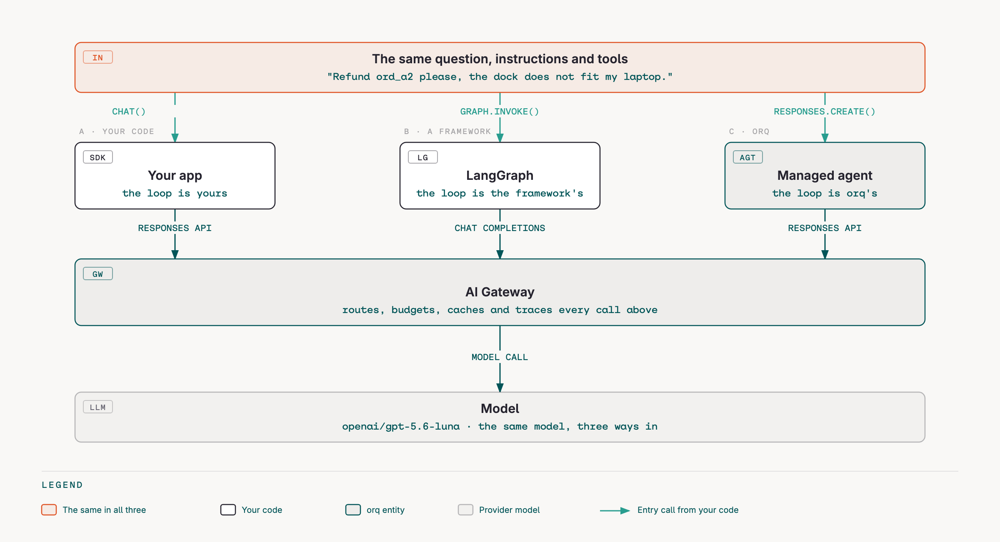
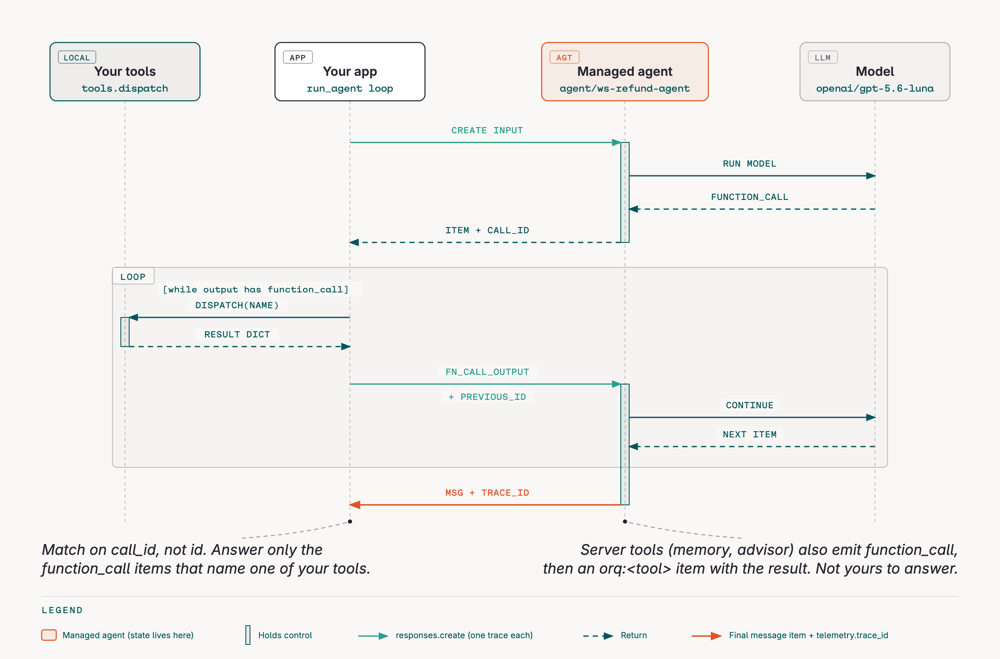
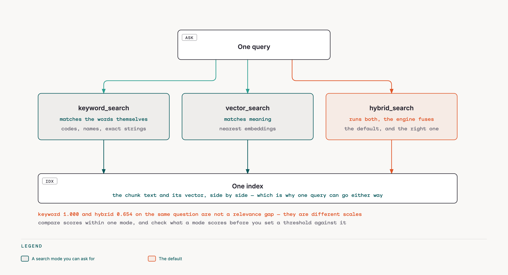
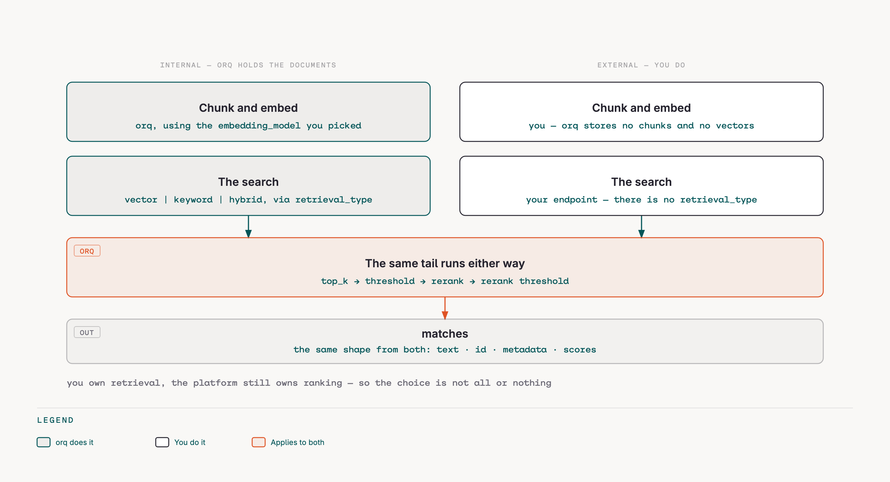
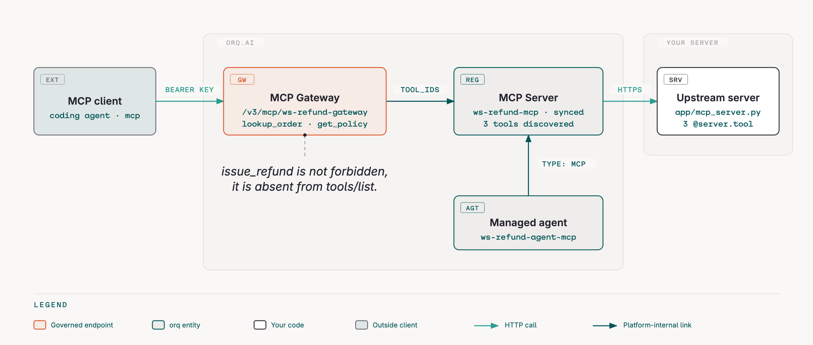

<!-- _class: lead -->
<!-- _paginate: false -->

# Building with orq.ai

## A hands-on workshop

**Own your agent · Managed agents · Knowledge base and RAG · MCP servers and the MCP Gateway**

one refund agent · four blocks · the rest is in the appendix

<!--
Timing: 0:00. Welcome, names, one line each on what they build. This deck is a spine, not a script.
Everything shown lives in the repo. Every block ends with "you try" and a "Done when".
-->

---

## How today works

- **One sample app**, a customer-support refund agent. It grows block by block.
- **Two tracks**, always: by hand (SDK, CLI, Studio) and with your coding agent (`orq launch claude`).
- **You already chose.** Four blocks, from what you wrote to us. Six more sit in the appendix.
- **Every block ends with "Done when."** Verify it in the Studio before we move on.
- **Parking lot** on the wall. Anything we skip becomes a follow-up.

<span class="tag">repo</span> `github.com/orq-ai/orq-workshop` · <span class="tag">docs</span> `orq-ai.github.io/orq-workshop`

<!-- 0:03. Point at the parking lot. Ask everyone to have the repo cloned and `make smoke` green before we start block 1. -->

---

<!-- _class: input -->

## How do you use orq today?

Pre-filled from your survey. Correct it, add to it.

| Question | Your answers | Add live |
|---|---|---|
| How does the team use orq? | Python SDK · AI Studio · gateway as a proxy | |
| Which coding agents? | OpenCode · Claude Code · Pi | |
| Frameworks on top? | LangGraph · orq SDK · Strands | |
| Most used areas | routing · budgets & keys · deployments & agents · tracing · experiments | |
| What you want from today | managed agents · KB and RAG, internal **and** external search · MCP servers and gateway · your own framework with orq around it | |

<!-- 0:05. Five minutes. Write their additions on the slide (or the whiteboard). These sharpen the four blocks; they do not change them. -->

---

<!-- _class: lead -->

# The map

<!-- 0:12. Fifteen minutes on the map, then straight into block 1. -->

---

## orq in one picture

```text
 your app / framework / coding agent
            │  OpenAI-compatible request (+ extra_body)
            ▼
 ┌───────────────── AI Gateway ─────────────────┐
 │ routing rules · smart router · fallbacks     │
 │ cache · budgets · guardrails · PII redaction │
 │ MCP Portal: MCP Servers + MCP Gateway        │
 └──────────────┬────────────────────────────────┘
                ▼
 ┌────────────── AI Studio ─────────────────────┐
 │ Traces & threads · Annotations · Evaluators  │
 │ Datasets · Experiments · Agents · Knowledge  │
 │ Memory stores · Prompts · Skills             │
 └───────────────────────────────────────────────┘
      ▲ orq CLI · orq MCP server · orq skills · orqi · evaluatorq
```

<!-- One credential, three doors: gateway, native SDK, CLI. Everything on the left is a request field. Everything on the right is a trace. -->

---

## The refund agent

Three tools. One loop. Ninety lines.

```python
def run_turn(messages, *, extra_body=None, ...) -> TurnResult:   # stateless reducer
    for _ in range(max_tool_rounds + 1):                          # our control flow
        response = client.responses.create(
            model=model, input=messages, tools=RESPONSES_TOOLS,   # NL -> tool calls
            store=False, extra_body=extra_body or {})             # no server state; gateway features ride here
        for call in (o for o in response.output if o.type == "function_call"):
            result = dispatch(store, call.name, args)             # tools are structured outputs
            messages.append({"type": "function_call_output", "call_id": call.call_id, "output": json.dumps(result)})
```

`lookup_order` · `issue_refund` · `get_policy`, with traps: post-window orders, an already refunded one, a EUR 620 one, PII in a customer note.

<!-- The app never changes across blocks. The request, the workspace and the harness around it do. -->

---

## What's new (4.10 to 4.14, CLI 8.x)

- **MCP Portal + MCP Gateway** (4.14): one governed endpoint for many MCP servers, per-tool exposure, denied calls logged
- **Smart Router** page, `route_pool`, quality / balanced / cost profiles (4.13)
- **Advisor and Sidekick** tools on agents (4.13)
- **System guardrails** PII + Secret detection, fail-closed, sampling (4.12, 4.13)
- **Budgets** as an entity: identity, key, project, model scopes; RPM, cost, tokens (4.11)
- **PII redaction plugin** with restore on the way back (4.11)
- **Annotations** with queues and API; guardrail indicators on spans; Codex sessions as traces
- **orq CLI 8**: `orq launch`, `orq connect --local`, `orq traces thread`, `orq doctor`, `orq orqi`
- **evaluatorq**: agent simulation, OWASP red teaming, exit-code gates

<!-- 0:22. One minute. Point at docs/whats-new.md for the module mapping. -->

---

<!-- _class: vote -->

## What you asked for

Two mails, four asks. Today is those four in depth, not ten in passing.

| | Block | Minutes | Repo |
|---|---|---|---|
| 1 | **Own your agent**: LangGraph or raw SDK, orq as the layer around it | 30 | `examples/`, 02, 08 |
| 2 | **Managed agents**: the loop runs in orq | 30 | 08, 15 |
| 3 | **Knowledge base and RAG**: internal *and* external search engines | 35 | 09 |
| 4 | **MCP servers and the MCP Gateway**: one governed endpoint | 25 | 10 |

Routing, model selection and monitoring: you said the docs cover those. They are in the appendix if you want them.

<!-- 0:27. Two minutes, not five. They answered this in writing already: confirm, then start. Swaps come out of the appendix. -->

---

<!-- _class: lead -->

# 1 · Own your agent

<span class="tag orange">examples/own-your-agent.py</span> <span class="tag">module 02</span> <span class="tag">module 08</span>

<!-- 0:32. The block Vansh asked for: keep the agent architecture framework-agnostic, use orq as the infrastructure layer. -->

---

<!-- _class: block -->

## 1 · The concept

**Keep your architecture. Rent the infrastructure.** The loop is yours, a framework's, or orq's. The gateway, the traces and the budgets are the same either way.



<!-- One question, three shapes. The only difference is who runs the loop; routing and tracing do not care. -->

---

<!-- _class: block -->

## 1 · Live demo

```bash
$ uv run python examples/own-your-agent.py     # one question, three legs, three trace ids
```

| | Who owns the loop | Protocol | Tracing setup |
|---|---|---|---|
| Raw orq SDK | you | Responses API | none, the gateway traces it |
| LangGraph | the framework | chat-completions | `orq_ai_sdk.langchain.setup()`, one line |
| Managed agent | orq | `model="agent/<key>"` | none |

Watch for: the same three tools in the same order, the same refund, three shapes of trace.

<!-- Open the three trace ids side by side in the Studio. That comparison is the whole argument. -->

---

<!-- _class: block -->

## 1 · You try · Done when

- [ ] `examples/own-your-agent.py` prints three trace ids
- [ ] All three found in the Studio, same tools in the same order
- [ ] One thing changed without touching the agent: a fallback, a budget, or a routing rule

**Gotchas:** LangGraph speaks chat-completions, so GPT-5.x wants `reasoning_effort="none"` before it accepts tool definitions · the framework leg names its run to find its own trace · the prompt is still a repo file in all three legs, a Deployment is what moves it into orq.

**Ask your agent:** "Add a fourth leg to examples/own-your-agent.py using a different framework through the orq gateway, and print its trace id too."

---

<!-- _class: lead -->

# 2 · Managed agents

<span class="tag orange">modules 08 · 15</span>

---

<!-- _class: block -->

## 2 · The concept

Same refund agent, hosted by orq: instructions, model, tools (function, HTTP, built-in, MCP), knowledge bases, memory stores, versions, environments.

```python
orq.responses.create(model="agent/ws-refund-agent", input="Refund {{order}} please",
                     variables={"order": "ord_a2"}, metadata={"channel": "chat"},
                     memory={"entity_id": "customer-user_001"}, thread={"id": "conv-7"})
```

Function tools come back as `function_call` items. **Your code executes them** and continues with `previous_response_id`. Tools stay structured outputs; state stays yours.

**Advisor** asks a second model for guidance mid-turn (it gets the transcript). **Sidekick** delegates a discrete task (it gets only the task). Each is its own span with its own cost: module 15 reads the split, one advisor call versus five agent calls.

---

<!-- _class: figure -->

## 2 · One turn, in one picture



<!-- Match on call_id, not id. A server tool (memory, advisor) also emits a function_call, then an orq:<tool> item with the result; that one is not yours to answer. -->

---

<!-- _class: block -->

## 2 · Live demo

```bash
$ orq agents get ws-refund-agent
$ make m08        # invoke with tool dispatch, stream, memory recall, a version bump
$ make m15        # advisor before a refusal, sidekick for the closing note, the cost split
$ orq traces thread <trace_id>
```

Watch for: the `function_call` item and the continuation · a second turn answering from `previous_response_id` alone · memory recalling the customer's name on the second call · `@production` in the model reference · the advisor changing "refuse" into "human review".

<!-- GET returns tools as action_type with ids. Never PATCH a GET body back. Say it out loud, it saves an hour. -->

---

<!-- _class: block -->

## 2 · You try · Done when

- [ ] `orq responses create --model agent/ws-refund-agent --input "refund ord_a1"` produces a trace with a tool call and a final message
- [ ] A second call with the same `memory.entity_id` recalls the name
- [ ] A new version exists and can be invoked by reference

**Gotchas:** memory is not automatic, instructions must say what to write · `max_execution_time` counts model time only · legacy `/v2/agents/run` is deprecated.

**Ask your agent:** "Use build-agent to create ws-refund-agent-v2 with the same tools plus an escalate_to_human tool, then invoke it with 'refund ord_a6' and show me the trace."

---

<!-- _class: lead -->

# 3 · Knowledge base and RAG

<span class="tag orange">module 09</span>

---

<!-- _class: block -->

## 3 · The concept

**Chunking is the biggest lever.** `POST /v2/chunking` with `token`, `sentence`, `recursive`, `semantic`, `agentic` strategies, then push the chunks with metadata.

**Search is a request**: `hybrid_search` (vector + keyword), a threshold, `top_k`, a rerank model, optional agentic RAG (query rewrite + document grading).

Three places retrieval can happen:
- your tool (`get_policy` calls `knowledge.search`)
- the gateway, on a plain chat call (`orq.knowledge_bases` in the request): pre-fetched context, no tool call
- the managed agent (`query_knowledge_base` built-in)

**External knowledge base**: your own `/search` endpoint behind the same contract.

---

<!-- _class: figure -->

## 3 · Three ways to match the same question



<!-- The scores are not comparable across modes: keyword comes from a text match, vector from embedding distance. A keyword 1.000 next to a hybrid 0.654 says nothing. -->

---

<!-- _class: figure -->

## 3 · Internal and external: who does what



<!-- The row that surprises people: go external and orq still cuts to top_k, applies the threshold and reranks what you return. You own retrieval; the platform still owns ranking. -->

---

<!-- _class: block -->

## 3 · Live demo

```bash
$ orq knowledge-bases search <id> --query "opened electronics after 20 days"
$ make m09        # vector vs keyword vs hybrid vs rerank, chunking strategies, KB as get_policy, gateway-side retrieval
```

Watch for: scores side by side · the retrieval span in the trace · the grounded answer with no tool call.

<!-- Processing is async. `retrieve_processing_status` before searching a fresh datasource. -->

---

<!-- _class: block -->

## 3 · You try · Done when

- [ ] A policy edge case answered with a retrieved chunk visible as a span
- [ ] `knowledge-bases search` returns that chunk with a rerank score
- [ ] One chunking strategy compared against another on the same document

**Gotchas:** external KB URLs must be public · `top_k` and threshold are the context window, own them · metadata filters need metadata at ingest.

**Ask your agent:** "Add app/data/kb/warranty.md as a new datasource to ws-refund-policy, wait for processing, then search for 'warranty length'."

---

<!-- _class: lead -->

# 4 · MCP servers and the MCP Gateway

<span class="tag orange">module 10</span>

---

<!-- _class: block -->

## 4 · The concept

Three things named MCP:

| | Who connects | What for |
|---|---|---|
| **Orq MCP server** `/v2/mcp` | your coding agent | administer the workspace: agents, datasets, evals, traces, docs |
| **MCP Servers** (MCP Portal) | orq | upstream tool servers you register: URL, auth, discovered tools |
| **MCP Gateway** `/v3/mcp/<key>` | any client, any agent | one endpoint over many servers, expose all/selected/none per server, read-only filters, every call logged, denied calls too |

The gateway is where "small, focused agents" becomes a setting: the refund agent sees `lookup_order` and `get_policy`, never `issue_refund`.

---

<!-- _class: figure -->

## 4 · The trust chain



<!-- The upstream URL must be reachable from orq: loopback and private addresses are rejected. The hidden tool is not forbidden, it is absent; tools/list never returns it. -->

---

<!-- _class: block -->

## 4 · Live demo

```bash
$ make mcp-server                    # app/mcp_server.py on :8000 (deployed publicly for the portal)
$ make m10                           # register server, sync, gateway with two exposed tools, call through it
$ orq mcp-gateways list-tools ws-refund-gateway
```

Watch for: the discovered tool list after sync · only two tools on the gateway · the call log with exposed vs upstream names.

<!-- Upstream URLs must be public. The instructor deploys app/mcp_server.py before the session; MCP_SERVER_URL in .env. -->

---

<!-- _class: block -->

## 4 · You try · Done when

- [ ] `list-tools` on the gateway shows exactly the two exposed tools
- [ ] A tool call through `/v3/mcp/<key>` appears in the gateway log
- [ ] You can explain Code Mode vs Direct Mode in one sentence each

**Gotchas:** loopback and private hosts are rejected · tool ids change on upstream rename after re-sync · the MCP Tool type on agents is retired, use the portal.

**Ask your agent:** "Connect ws-refund-gateway to this session, use lookup_order on ord_a2, then tell me which tools the gateway hides from you and why that is the point."

---

## Checkpoint: what would you apply to your own app?

| Block we just did | One thing to try at work | Blocker or question |
|---|---|---|
| | | |
| | | |
| | | |

<!-- Use this slide after every two blocks. Two minutes. Write on the slide. Move blockers to the parking lot. -->

---

<!-- _class: input -->

## Parking lot

Things we skipped, questions we could not answer, requests for a follow-up.

-
-
-
-

---

<!-- _class: lead -->

# Wrap-up

<!-- 2:45. Fifteen minutes. -->

---

## Next steps

1. **Today**: `make setup && make smoke` in this repo. Every block you missed is a module with a solution.
2. **This week**: `orq connect --local` in your own repo. Paste the `setup-observability` prompt. Get one real trace.
3. **Next week**: `make traffic`-style volume on your own app, then `analyze-trace-failures`. One evaluator per failure mode.
4. **Before the next release**: `evals.yml` in your CI. Static red team on the agents that hold tools.
5. **Follow-up session**: the parking lot decides.

**Docs** orq-ai.github.io/orq-workshop · **Repo** github.com/orq-ai/orq-workshop · **Platform docs** docs.orq.ai

---

<!-- _class: lead -->
<!-- _paginate: false -->

# Thank you

Questions, and the parking lot.

---

<!-- _class: lead -->

# Appendix

The blocks we did not run today. Each one is complete: concept, live demo, you-try, gotchas.

<!-- Routing, guardrails, tracing, evals, simulation, CI and coding agents. Use them if the room asks, or hand the deck over afterwards. -->

---

<!-- _class: lead -->

# Modules, one slide each

All 18 modules in the repo, in order. Each one runs on its own with **make mNN**.

<!-- Use this as the index when someone asks "where is X". The blocks after it group these modules for a live session. -->

---

<!-- _class: block -->

## 00 · Setup

**One key, three doors:** the OpenAI-compatible gateway, the native SDK, and the `orq` CLI that also wires your coding agent.

| | |
|---|---|
| **Time** | 20 min |
| **Needs** | an orq.ai account, Python 3.11+, uv |
| **You will have** | a working `.env`, a green `orq doctor`, one traced call |

`make m00` · <span class="tag">docs</span> `modules/00` · <span class="tag orange">before block 1</span>

---

<!-- _class: block -->

## 01 · Gateway

**Two decisions you can read in a trace:** the model turns "refund ord_a2" into a tool call; the gateway turns "the provider is down" into a fallback.

| | |
|---|---|
| **Time** | 25 min |
| **Needs** | module 00 |
| **You will have** | fallbacks, retry, cache and load balancing on the refund agent, each visible as a span |

`make m01` · <span class="tag">docs</span> `modules/01` · <span class="tag orange">block A</span>

---

<!-- _class: block -->

## 02 · Tracing

**The context window, readable after the fact.** Identity, thread and metadata ride on the same request.

| | |
|---|---|
| **Time** | 30 min |
| **Needs** | module 01 |
| **You will have** | traces searchable by thread and customer, one `refund_turn -> tool -> llm` trace, one human annotation |

`make m02` · <span class="tag">docs</span> `modules/02` · <span class="tag orange">block C</span>

---

<!-- _class: block -->

## 03 · Smart routing

**Which model answers is a decision**, moved out of the code: a Smart Router that picks per request, and a routing rule that overrides it.

| | |
|---|---|
| **Time** | 20 min |
| **Needs** | module 01 |
| **You will have** | `ws-refund-router` called by reference, traces showing which model it picked, a rule sending cheap-tier traffic to `gpt-5.4-nano` |

`make m03` · <span class="tag">docs</span> `modules/03` · <span class="tag orange">block A</span>

---

<!-- _class: block -->

## 04 · Guardrails

**A block is the hand-off to a human.** The gateway returns an error the app can catch; the model never has to be prompted into asking for help.

| | |
|---|---|
| **Time** | 25 min |
| **Needs** | module 00, `make seed` |
| **You will have** | PII placeholders before the provider, an over-limit refund turned into a hand-off, a gateway rule for unguarded calls |

`make m04` · <span class="tag">docs</span> `modules/04` · <span class="tag orange">block B</span>

---

<!-- _class: block -->

## 05 · Budgets and keys

**Spend is a request attribute, not a spreadsheet.** Who calls, for whom, and how much they may spend, enforced by the gateway.

| | |
|---|---|
| **Time** | 15 min, instructor demo |
| **Needs** | module 00, workspace admin |
| **You will have** | a purpose-built API key, an identity, two budgets that block the third call in a minute |

`make m05` · <span class="tag">docs</span> `modules/05` · <span class="tag orange">block A</span>

---

<!-- _class: block -->

## 06 · Troubleshooting with orqi

**Ask your workspace questions in plain language.** orqi operates the platform; it does not build your app.

| | |
|---|---|
| **Time** | 15 min |
| **Needs** | module 00, orqi installed, traffic from modules 01 to 04 (or `make traffic`) |
| **You will have** | four real answers about your workspace, a seeded client-side failure diagnosed, when to use orqi vs `orq launch` |

`make m06` · <span class="tag">docs</span> `modules/06` · <span class="tag orange">block C</span>

---

<!-- _class: block -->

## 07 · Failure analysis and evals

**A prompt you own is a prompt you can measure.** Traces say what it does, a taxonomy says what to fix, an evaluator says whether the fix held.

| | |
|---|---|
| **Time** | 40 min |
| **Needs** | modules 00 and 02 |
| **You will have** | a taxonomy from 20 conversations, two evaluators, `ws-refund-eval`, an Experiment comparing fixed vs vulnerable |

`make m07` · <span class="tag">docs</span> `modules/07` · <span class="tag orange">block D</span>

---

<!-- _class: block -->

## 08 · Managed agents

**The agent lives in orq, your code executes the tools.** Every `function_call` comes back to you; the conversation resumes server-side.

| | |
|---|---|
| **Time** | 40 min |
| **Needs** | modules 00 to 02, `make seed` |
| **You will have** | the refund agent over the Responses API with a local tool loop, streamed, with memory, pinned by `@version` |

`make m08` · <span class="tag">docs</span> `modules/08` · <span class="tag orange">blocks 1 and 2</span>

---

<!-- _class: block -->

## 09 · Knowledge base and RAG

**Retrieval decides what the model sees.** Chunking decides what retrieval can find. Both are settings you own.

| | |
|---|---|
| **Time** | 35 min |
| **Needs** | modules 00 to 02, `make seed` |
| **You will have** | the policy searched three ways, re-chunked two ways, wired in place of `get_policy`, pre-fetched, and searched by a managed agent |

`make m09` · <span class="tag">docs</span> `modules/09` · <span class="tag orange">block 3</span>

---

<!-- _class: block -->

## 10 · MCP Gateway

**One set of tools, three callers, one allow-list.** A small agent gets `lookup_order` and `get_policy`; nobody outside gets `issue_refund`.

| | |
|---|---|
| **Time** | 30 min |
| **Needs** | module 00, `make seed` |
| **You will have** | the tools as an MCP server, `ws-refund-gateway` exposing two of three, an MCP client and a coding agent on it, a managed-agent MCP span |

`make m10` · <span class="tag">docs</span> `modules/10` · <span class="tag orange">block 4</span>

---

<!-- _class: block -->

## 11 · Agent simulation

**Testing an agent is cheap when the agent is a function.** `run_turn(messages) -> messages` has no hidden state, so a simulated customer can replay it at will.

| | |
|---|---|
| **Time** | 30 min |
| **Needs** | modules 00 and 07, `make seed` |
| **You will have** | four simulation runs as Experiments and in the local dashboard, a managed-agent adapter, one surprise about judges |

`make m11` · <span class="tag">docs</span> `modules/11` · <span class="tag orange">block H</span>

---

<!-- _class: block -->

## 12 · Evals in CI

**A gate is an agent run with an exit code.** The same key runs the agent, the judge, the red team and a headless coding agent.

| | |
|---|---|
| **Time** | 35 min |
| **Needs** | modules 00, 07 and 16 |
| **You will have** | `make eval` green then red, a static red-team gate, three GitHub workflows, two headless agent runs |

`make m12` · <span class="tag">docs</span> `modules/12` · <span class="tag orange">block I</span>

---

<!-- _class: block -->

## 13 · Coding agents

**Your workspace from a coding agent.** A Claude Code, OpenCode, Pi or Codex session is just another traced, budgeted client.

| | |
|---|---|
| **Time** | 25 min |
| **Needs** | module 00, one coding agent installed |
| **You will have** | a dry-run of `orq connect`, the env `orq launch` injects, the CLI skills, a session visible as traces with cost |

`make m13` · <span class="tag">docs</span> `modules/13` · <span class="tag orange">block J</span>

---

<!-- _class: block -->

## 14 · Alerts and webhooks

**The platform pushes to you.** A Reporting API query gives the number, an alert watches it, a webhook delivers every call, signed.

| | |
|---|---|
| **Time** | 30 min |
| **Needs** | module 02, `make seed`, a public URL for the receiver |
| **You will have** | a cost alert that opened a trigger on your burst, signed events at a receiver you run |

`make m14` · <span class="tag">docs</span> `modules/14` · <span class="tag orange">block C</span>

---

<!-- _class: block -->

## 15 · Advisor and sidekick

**Hand one step to a second model.** Each call is metered on its own span. Neither is a sub-agent: one call, no tools, no memory.

| | |
|---|---|
| **Time** | 30 min |
| **Needs** | module 08, `make seed` |
| **You will have** | an agent that consults `gpt-5.6-sol` before a refusal and delegates the closing note to `gpt-5.4-nano`, cost read off one trace |

`make m15` · <span class="tag">docs</span> `modules/15` · <span class="tag orange">block 2</span>

---

<!-- _class: block -->

## 16 · Red teaming

**An attacker is a simulated user with a worse goal.** The module 11 loop now tries to break the agent, and the tool results say what really happened.

| | |
|---|---|
| **Time** | 30 min |
| **Needs** | modules 07 and 11, `make seed` |
| **You will have** | two red-team runs as Experiments, a per-target resistance rate, a CLI gate that exits 0 or 1 |

`make m16` · <span class="tag">docs</span> `modules/16` · <span class="tag orange">block H</span>

---

<!-- _class: block -->

## 17 · Annotation queues and automations

**The human loop.** A queue collects traces worth a look, an automation fills it, a reviewer scores, the reviewed traces become a dataset.

| | |
|---|---|
| **Time** | 25 min |
| **Needs** | modules 02 and 07, `make seed` |
| **You will have** | `ws-review-queue` filled by hand and by automation, items annotated by API, bad ones promoted to `ws-review-dataset` |

`make m17` · <span class="tag">docs</span> `modules/17` · <span class="tag orange">block C</span>

---

<!-- _class: lead -->

# Block A · Gateway, smart routing, budgets

<span class="tag orange">modules 01 · 03 · 05</span>

---

<!-- _class: block -->

## A · The concept

**Everything is a request field.** Point any OpenAI client at `https://my.orq.ai/v3/router` and add to `extra_body`:

```python
extra_body={
  "timeout":   {"call_timeout": 1500},
  "fallbacks": [{"model": "openai/gpt-5.4-nano"}],
  "retry":     {"count": 1, "on_codes": [429, 500, 502, 503, 504]},
  "cache":     {"type": "exact_match", "ttl": 600},
  "load_balancer": {"type": "weight_based", "models": [...]},
  "identity": {"id": "customer-42"}, "thread": {"id": "conv-1"}, "metadata": {"tier": "free"},
}
```

A **smart router** is a model id (`<workspace>@orq/refund-router`) that picks from a pool per request. A **routing rule** rewrites the model for matching traffic at the gateway. A **budget** stops traffic per identity, key, project or model.

---

<!-- _class: block -->

## A · Live demo

```bash
$ make m01        # plain, forced fallback (timeout), cache hit, load balancer
$ make m03        # smart router COST vs QUALITY, one routing rule
$ orq budgets list --profile management   # third call in a minute rejected
```

Watch for: `span.fallback_selected` · cached span with zero cost · `orq.auto_router.selected_model` · the budget error text.

<!-- Have the trace list open before you start. Fallback shows only if gpt-5.6-sol exceeds 1500 ms; rerun if it did not. -->

---

<!-- _class: block -->

## A · You try · Done when

Open `modules/01-gateway/run.py`, fill the three `TODO`s, run it.

- [ ] A trace with a `span.fallback_selected` span
- [ ] A second identical request served from cache
- [ ] Smart router traces show two different selected models across profiles
- [ ] You can say why an unknown model id does not fall back

**Gotchas:** every fallback gets the same timeout · GPT-5.x rejects `tools` on chat completions unless `reasoning_effort` is `none` (the app uses Responses) · budgets need a Management Key.

**Ask your agent:** "Add a fallback chain and a cache to module 01 without touching app/, then fetch the fallback trace's spans over MCP and tell me which model answered."

---

<!-- _class: lead -->

# Block B · Guardrails and PII

<span class="tag orange">module 04</span>

---

<!-- _class: block -->

## B · The concept

Three different things, often confused:

| | What it does | Where |
|---|---|---|
| **PII redaction plugin** | replaces PII with placeholders before the provider, restores after | `plugins: [{"id": "pii_redaction"}]` or workspace-wide |
| **System guardrails** | PII Detection, Secret Detection: block, fail-closed | guardrail rule |
| **Your guardrails** | LLM judge or Python function with a pass condition, blocks with 422 | `guardrails: [{"id": ..., "execute_on": "output"}]` or rule |

A blocked request is the **hand-off to a human**. Factor 7 without a framework.

---

<!-- _class: block -->

## B · Live demo

```bash
$ orq pii redact --text "contact me at jane.doe@example.com or +31 6 1234 5678"
$ make m04        # plugin on a refund call, the order-id surprise, a 422 on a EUR 620 refund, a project-scoped rule
```

Watch for: placeholders in the span input, originals in the answer · what happened to `ord_a1` · the 422 body · the guardrail indicator on the span (4.14).

<!-- The order-id redaction is a seeded failure. Let them find it. Then discuss entity lists and output-only guardrails. -->

---

<!-- _class: block -->

## B · You try · Done when

- [ ] A trace where the provider saw `<EMAIL_ADDRESS>` and the customer saw the real address
- [ ] A refund above EUR 500 blocked with 422 by `ws-refund-limit-guard`
- [ ] A guardrail rule scoped to the project, then disabled

**Gotchas:** system guardrails always fail closed · a rule without a project and with an empty expression is workspace-wide · redaction is a design decision per entity type.

**Ask your agent:** "Add a Python guardrail that blocks any answer repeating an email address and attach it to the refund agent's output via the orq MCP tools."

---

<!-- _class: lead -->

# Block C · Tracing, troubleshooting with orqi, alerts

<span class="tag orange">modules 02 · 06 · 14 · 17</span>

---

<!-- _class: block -->

## C · The concept

**Level 1**: zero code. Every gateway call is a trace with cost, tokens, latency.
**Level 2**: identity, thread, metadata on the request (top-level fields). Traces become conversations and customers.
**Level 3**: your own spans. `@traced(type="agent")` around the turn, `@traced(type="tool")` around each tool, or OpenTelemetry from any framework (LangGraph, Strands, CrewAI, ...).

Then: **orqi**, the terminal helper. It reads your traces with the orq MCP tools and its own skills: `investigate-root-cause`, `debug-conversation`, `workspace-health-check`, `optimize-cost`.

Then the platform pushes to you: an **alert** on a Reporting API metric opens a trigger and notifies; a **webhook** delivers `llm.response` events, signed, to a receiver you run; a **trace automation** routes matching traces into an annotation queue a human reviews.

```bash
$ orqi "list the traces with errors from the last 2 hours and group them by root cause"
$ orq alerts list-triggers <alert_id>
```

---

<!-- _class: block -->

## C · Live demo

```bash
$ make m02                          # identity + thread, otel spans, one annotation
$ orq traces thread <trace_id>      # readable transcript
$ orqi /doctor
$ orqi "why did trace <id> fail?"
$ make m14                          # cost alert + burst, a signed webhook at your receiver
$ make m17                          # fill the review queue, annotate by API, promote to a dataset
```

Watch for: the thread view grouping two turns · agent → tool → llm nesting · orqi naming the root cause you already know · the trigger that opened on the burst (run m14 before the session, the alert ticks every 5 minutes).

<!-- Seeded failure: a broken ORQ_BASE_URL in a temp .env. orqi has to find a client-side cause, not only a trace. -->

---

<!-- _class: block -->

## C · You try · Done when

- [ ] A trace with a root `agent` span, nested `tool` spans and the LLM spans
- [ ] Two turns grouped under one thread with an identity
- [ ] One annotation on a span
- [ ] orqi found the broken base URL from the error text
- [ ] `orq alerts list-triggers` shows the trigger your burst opened

**Gotchas:** short scripts must flush the exporter · annotation keys must exist in the workspace · orqi is alpha, pin `ORQI_VERSION`.

**Ask your agent:** "Use the setup-observability skill on this repo and tell me the three changes you would make, without applying them."

---

<!-- _class: lead -->

# Block D · Failure analysis to evaluators to experiments

<span class="tag orange">module 07</span>

---

<!-- _class: block -->

## D · The concept

The loop that makes quality measurable:

1. **Look at traces** (twenty is enough). Name what goes wrong: open coding, then axial coding. A **failure taxonomy** of two to four modes.
2. **One evaluator per failure mode.** Binary pass/fail judges, validated against a few labelled examples. Python where a regex will do.
3. **A dataset** of the cases that matter. Real ones first, synthetic to fill gaps.
4. **An experiment**: two configurations, same dataset, same evaluators. Read the table, not the vibes.

The orq skills encode exactly this: `analyze-trace-failures` → `build-evaluator` → `generate-synthetic-dataset` → `run-experiment`.

---

<!-- _class: block -->

## D · Live demo

```bash
$ make traffic    # 20 conversations, half with the vulnerable instructions
$ make m07        # taxonomy from real traces, judge invoked, evaluatorq experiment fixed vs vulnerable
```

Watch for: which failure modes the vulnerable variant produces · the judge's true/false on a good and a bad answer · the experiment URL and the table in the Studio.

<!-- If the room has a coding agent ready, run the skill chain in parallel on a second screen. -->

---

<!-- _class: block -->

## D · You try · Done when

- [ ] A failure taxonomy with at least two named modes from your own traces
- [ ] The LLM judge returns true on a good answer and false on a bad one
- [ ] An Experiment run in the Studio comparing fixed vs vulnerable with two evaluators

**Gotchas:** judges are non-deterministic, gate on means · use a non-reasoning judge model · ten traces is the minimum for a taxonomy.

**Ask your agent:** "Use analyze-trace-failures on traces tagged traffic, then build-evaluator for the top failure mode, then run-experiment on dataset ws-refund-eval."

---

<!-- _class: lead -->

# Block H · Simulation and red teaming

<span class="tag orange">modules 11 · 16</span>

---

<!-- _class: block -->

## H · The concept

**Simulation**: a user-simulator LLM plays a persona with a goal against your agent, turn by turn; a judge scores goal reached and rules broken. `simulate()`, `generate_and_simulate()`, replay a previous run to prove a fix.

**Red teaming**: OWASP LLM Top 10 and Agentic (ASI) categories. Static mode replays a fixed attack set (deterministic, CI-safe); dynamic mode adapts mid-conversation. Agent-aware: it reads the agent's tools and memory and attacks what the agent can actually do.

Both push results to the Studio as **Experiment runs**. Both route their attacker and judge calls through the gateway, so they are traced and budgeted like everything else.

---

<!-- _class: block -->

## H · Live demo

```bash
$ make m11        # 2 personas x 2 scenarios, generated personas, the managed agent twice
$ make m16        # red team vulnerable vs fixed (static), the CLI gate
$ uv run eq redteam run -t "agent:ws-refund-agent-vulnerable" --mode static --max-static-datapoints 4 -y
```

Watch for: the resistance rate per target · which attack got a refund on the vulnerable agent · the five-line diff between the two instruction files.

<!-- Keep the datapoint cap small. Dynamic mode is a demo, not a lab. -->

---

<!-- _class: block -->

## H · You try · Done when

- [ ] A simulation run with per-conversation verdicts in the Studio
- [ ] The vulnerable agent fails and the fixed agent passes the same static attack set
- [ ] You can name the OWASP category of the attack that worked

**Gotchas:** simulation is Python only · agents whose tools run in your code need an AgentTarget adapter · attacker and judge cost money, cap them.

**Ask your agent:** "Use red-team on ws-refund-agent-vulnerable for LLM07 and ASI01, then propose the instruction change."

---

<!-- _class: lead -->

# Block I · Evals and headless agents in CI

<span class="tag orange">module 12</span>

---

<!-- _class: block -->

## I · The concept

**Evals as regression, not benchmark.** evaluatorq scorers return `pass_`; any failure exits 1; thresholds are means over the dataset. The red-team static gate is the same idea for security.

```yaml
# .github/workflows/evals.yml
jobs:
  quality:  run: uv run python -m evals.regression      # exit 1 on regression
  security: run: uv run python -m evals.redteam_gate     # exit 1 on a successful attack
```

**Headless agents as routine tasks.** `orqi "<prompt>"` and `orq launch claude -p "<prompt>"` run once and exit. Put them on a cron: nightly trace triage, weekly cost report, PR-time failure analysis. One `ORQ_API_KEY`, no vendor keys, a budget on that key.

---

<!-- _class: block -->

## I · Live demo

```bash
$ make eval                                   # green with fixed instructions
$ uv run python -m evals.regression --instructions app/data/vulnerable_instructions.md   # red
$ make redteam-gate
$ CI=1 orqi "list the traces with errors from the last 24 hours, group by root cause, markdown"
```

Watch for: exit codes · the step-summary markdown · the triage report and its own trace with cost.

<!-- Show the PR in the repo that swaps the instructions and the red check. -->

---

<!-- _class: block -->

## I · You try · Done when

- [ ] `make eval` exits 0 on fixed and 1 on vulnerable instructions
- [ ] The workflow file makes sense line by line: secrets, fork PRs, concurrency, summary
- [ ] A nightly triage run produced a markdown report

**Gotchas:** fork PRs get no secrets · static red team only in CI · pin `ORQI_VERSION`, set `CI=1` · give headless prompts an output contract.

**Ask your agent:** "Open a PR that swaps the fixed instructions for the vulnerable ones and explain the failing check from the step summary."

---

<!-- _class: lead -->

# Block J · Coding agents wired to orq

<span class="tag orange">module 13</span>

---

<!-- _class: block -->

## J · The concept

```bash
$ orq launch claude            # this session only: gateway routing, orq MCP server, orq skills
$ orq connect --local          # permanent, per project, per capability: gateway | skills | mcp
$ orq connect --status
```

Claude Code, OpenCode, Pi, Codex, Kimi, Kilo. Every model call the agent makes is a trace with cost. Budgets apply. The 14 orq skills ship inside the CLI: `setup-observability`, `analyze-trace-failures`, `build-evaluator`, `run-experiment`, `build-agent`, `red-team`, `simulate-agent`, ...

Slash commands in Claude Code: `/orq:quickstart` `/orq:workspace` `/orq:traces` `/orq:models` `/orq:analytics`

---

<!-- _class: block -->

## J · Live demo · You try

```bash
$ orq connect --local --dry-run     # exactly which files would change
$ orq launch claude --dry-run       # the env and MCP wiring
$ orq launch claude -p "run orq doctor and summarise in three lines"
```

- [ ] `orq connect --status` shows gateway, skills and mcp for this project
- [ ] Your own coding-agent session is visible in Traces with cost per model
- [ ] You ran one orq skill end to end

**Apply it to your repo tomorrow:** `orq connect --local` → paste the `setup-observability` prompt → first trace → `analyze-trace-failures` after a week.

---

<!-- _class: input -->

